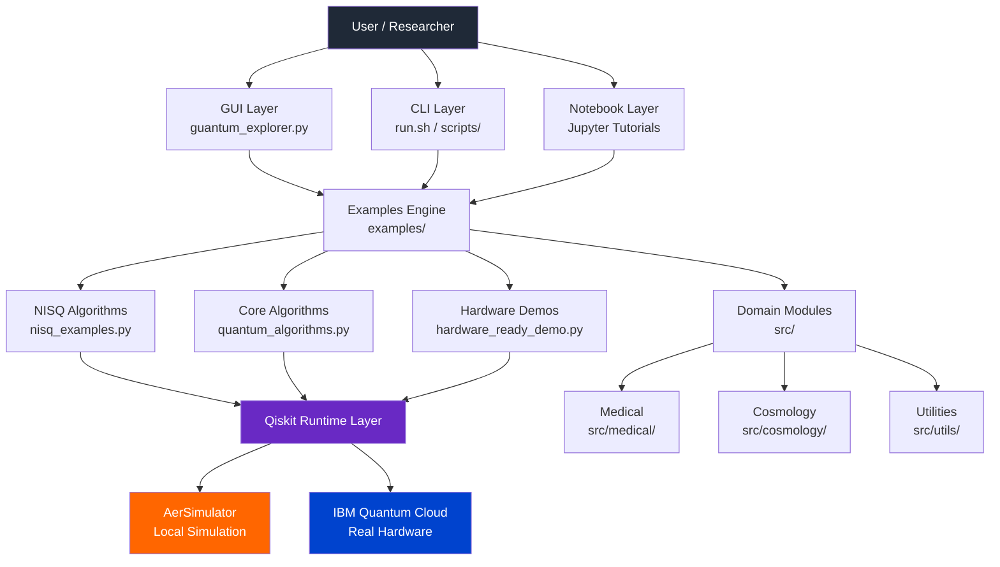
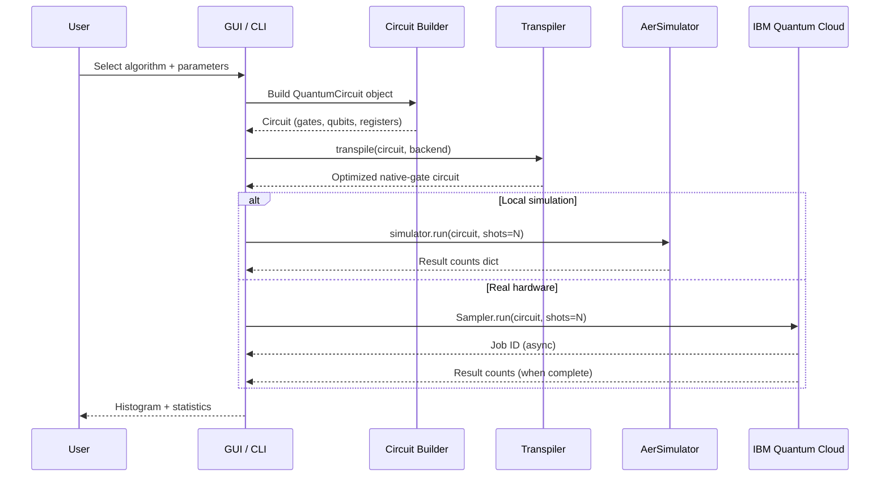
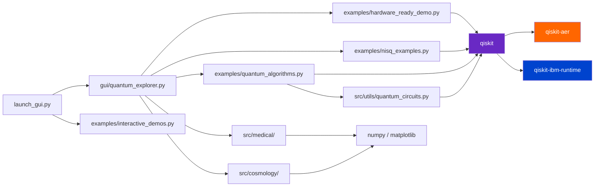
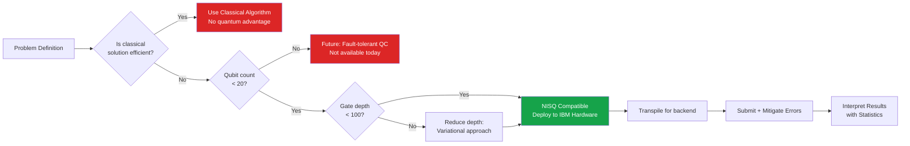
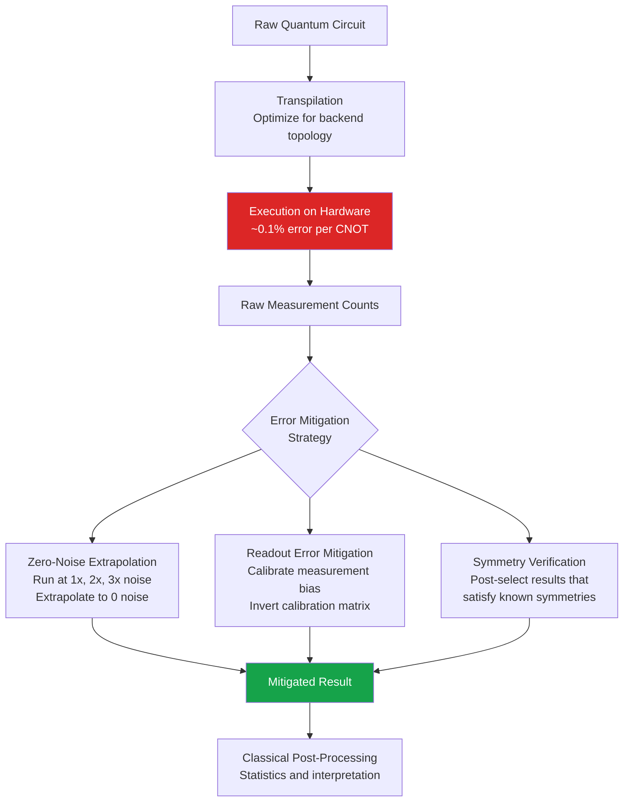

<p align="center">
  
  
  
  
  
  
</p>

<p align="center">
  
  
  
  
  
  
</p>

---

# Quantum Computing Explorer

<p align="center">
  
  &nbsp;&nbsp;&nbsp;
  
  <br/>
  <em>Left: IBM Quantum System One at the TJ Watson Research Center - the dilution refrigerator housing enclosure that cools qubits to 15 millikelvin, colder than outer space. Right: Google's 53-qubit Sycamore processor chip on display at the Deutsches Museum, Munich - the chip used in the 2019 quantum supremacy experiment. Both represent superconducting transmon qubit architectures, yet use different gate sets and qubit topologies. IBM uses a heavy-hex lattice with ECR native gates; Google uses a grid topology with CZ native gates. This project targets IBM hardware via Qiskit but the algorithms are architecture-agnostic.</em>
</p>

> **A hardware-ready, NISQ-era quantum computing framework** for experimental quantum algorithms and simulations spanning medical genomics, cosmology, quantum machine learning, and quantum cryptanalysis. This project gives researchers, students, and engineers an interactive environment to learn, simulate, and deploy quantum algorithms - from foundational circuits to cutting-edge applications including RSA decryption attacks, post-quantum cryptography, and BB84 quantum key distribution.

Quantum computing represents a fundamentally different computational paradigm. Instead of classical bits that hold either `0` or `1`, quantum computers use **qubits** that can exist in superpositions of both states simultaneously. When combined with entanglement and quantum interference, these properties allow certain algorithms to solve problems exponentially faster than any classical machine could. This repository provides a practical, hands-on toolkit for exploring that power today - using real quantum hardware accessible through IBM Quantum's cloud platform.

This project covers six distinct research domains: quantum algorithm fundamentals (Deutsch-Josza, Grover's search, QFT), hybrid variational methods (VQE, QAOA), quantum cryptanalysis and post-quantum cryptography (Shor's RSA factoring attack, Grover's AES key-search, BB84 QKD), medical quantum applications (drug discovery, protein folding, genomic analysis, biomarker detection), cosmological quantum information theory (black hole information paradox, Hawking radiation), and quantum machine learning. Each domain lives as an independent module under `src/` so researchers can import individual components without pulling in unrelated dependencies.

The design philosophy is deliberately NISQ-first. Every algorithm was selected and tuned to run on today's quantum hardware - devices with 50-500 noisy qubits. This means keeping circuits shallow (under 100 gate layers), using hybrid classical-quantum loops where the noise-sensitive quantum part stays minimal, and applying error mitigation at the result interpretation stage. The aim is not toy demonstrations but real circuits that can be submitted to IBM Quantum's cloud and return meaningful results within the limits of current hardware fidelity.

From a software engineering perspective the project follows a clean layered architecture: a PyQt5 GUI and Jupyter notebooks at the top, runnable example scripts in the middle, and importable domain-science modules in `src/` at the base. This separation means a domain scientist can use the medical or cosmology modules without touching the GUI code, while a quantum algorithm researcher can extend the examples layer without knowing anything about domain science. The cryptography module (`src/cryptography/quantum_cryptanalysis.py`) follows the same pattern - import it directly in Python or run it as a standalone terminal demo.

---

## Table of Contents

- [Why Quantum Computing?](#why-quantum-computing)
- [Quick Comparison - When to Use What](#quick-comparison---when-to-use-what)
- [Architecture Overview](#architecture-overview)
- [Tech Stack](#tech-stack)
- [Algorithms and Formulas](#algorithms-and-formulas)
- [Getting Started](#getting-started)
- [Project Structure](#project-structure)
- [Module Reference](#module-reference)
- [Running on IBM Hardware](#running-on-ibm-quantum-hardware)
- [Medical Applications](#medical-applications)
- [Cosmology Applications](#cosmology-applications)
- [Quantum Cryptography and Decryption](#quantum-cryptography-and-decryption)
- [Performance and Benchmarks](#performance-and-benchmarks)
- [Learning Resources](#learning-resources)
- [Citations and References](#citations-and-references)
- [Contributing](#contributing)

---

## Global Quantum Hardware Landscape

Quantum computing is not a single technology - it is a family of competing physical implementations, each with different strengths, qubit counts, error rates, and native gate sets. IBM and Google are the most visible players, but the field is genuinely global with major programs in the US, Canada, Europe, China, and Japan. Understanding who builds what - and how their hardware differs - is essential context for writing portable quantum algorithms.

The competitive landscape has intensified dramatically since 2019. National governments are treating quantum computing as strategic infrastructure - the US committed over $1.8 billion through the National Quantum Initiative Act, the EU pledged EUR 1 billion through its Quantum Flagship program, China reportedly invests several billion annually, and the UK launched a GBP 2.5 billion National Quantum Strategy in 2023. Japan, Canada, Australia, and India all have formal national quantum programs. This geopolitical dimension explains why hardware availability varies by organization - some of the most capable hardware (Chinese USTC Wukong, government labs like NIST and Sandia) is not accessible from foreign networks, making IBM's open cloud access particularly valuable for international research.

The qubit count race, while headline-grabbing, is largely a distraction for practical NISQ work. A 10-qubit machine with 99.9% two-qubit gate fidelity is more useful than a 1000-qubit machine with 99% fidelity, because errors compound multiplicatively across gate layers. Quantinuum's 32-qubit H2 system achieves two-qubit gate fidelity exceeding 99.9%, making it more capable for specific algorithms than IBM's 127-qubit devices despite far fewer qubits. The right metric is "algorithmic qubit count" - qubits effectively usable for a computation - not raw physical qubit count. IonQ explicitly publishes this metric to allow fair cross-architecture comparisons.

Looking forward, hardware roadmaps converge on error-corrected fault-tolerant quantum computers (FTQC) as the long-term target. IBM's public roadmap targets logical qubit operations by 2033. Google aims for a million-physical-qubit error-corrected machine. PsiQuantum is building photonic chips in standard semiconductor fabs targeting millions of qubits using CMOS manufacturing infrastructure. This project is architected to benefit from this trajectory - the circuits here will run faster, deeper, and on larger problem instances as hardware improves, without changes to the algorithm logic. The cryptography modules will become especially significant: Shor's algorithm currently requires thousands of error-corrected logical qubits to factor RSA-2048, but that threshold will be crossed within this decade by most published roadmap projections.

### Table 0 - Who Has a Quantum Computer? Major Platforms Compared

| # | Organization | Country | Technology | Max Qubits (2024) | Native 2Q Gate | Cloud Access | NISQ Ready |
|---|---|---|---|---|---|---|---|
| 1 | <sub>IBM Quantum</sub> | <sub>USA</sub> | <sub>Superconducting transmon</sub> | <sub>433 (Osprey)</sub> | <sub>ECR</sub> | <sub>Yes - free tier</sub> | <sub>Yes</sub> |
| 2 | <sub>Google Quantum AI</sub> | <sub>USA</sub> | <sub>Superconducting transmon</sub> | <sub>70 (Sycamore+)</sub> | <sub>CZ / fSim</sub> | <sub>Limited (partners)</sub> | <sub>Yes</sub> |
| 3 | <sub>D-Wave Systems</sub> | <sub>Canada</sub> | <sub>Superconducting flux qubit (annealing)</sub> | <sub>5000+ (Advantage)</sub> | <sub>N/A - annealing</sub> | <sub>Yes - Leap cloud</sub> | <sub>Optimization only</sub> |
| 4 | <sub>IonQ</sub> | <sub>USA</sub> | <sub>Trapped ion (Ytterbium)</sub> | <sub>32 (algorithmic)</sub> | <sub>MS gate (XX)</sub> | <sub>Yes - AWS/Azure</sub> | <sub>Yes</sub> |
| 5 | <sub>Quantinuum (Honeywell)</sub> | <sub>USA/UK</sub> | <sub>Trapped ion (Ytterbium)</sub> | <sub>32 (H2)</sub> | <sub>ZZ gate</sub> | <sub>Yes - Azure</sub> | <sub>Yes - highest fidelity</sub> |
| 6 | <sub>Rigetti Computing</sub> | <sub>USA</sub> | <sub>Superconducting transmon</sub> | <sub>84 (Ankaa)</sub> | <sub>CZ / XY</sub> | <sub>Yes - AWS</sub> | <sub>Yes</sub> |
| 7 | <sub>Origin Quantum (USTC)</sub> | <sub>China</sub> | <sub>Superconducting</sub> | <sub>72 (Wukong)</sub> | <sub>CZ</sub> | <sub>Yes - domestic</sub> | <sub>Yes</sub> |
| 8 | <sub>RIKEN / Fujitsu</sub> | <sub>Japan</sub> | <sub>Superconducting transmon</sub> | <sub>64</sub> | <sub>CNOT</sub> | <sub>Limited</sub> | <sub>Research</sub> |
| 9 | <sub>PsiQuantum</sub> | <sub>USA/Australia</sub> | <sub>Photonic (silicon)</sub> | <sub>N/A (pre-production)</sub> | <sub>KLM gates</sub> | <sub>No</sub> | <sub>Future FT target</sub> |
| 10 | <sub>NIST / Sandia</sub> | <sub>USA (govt)</sub> | <sub>Trapped ion (Beryllium/Calcium)</sub> | <sub>~50</sub> | <sub>MS gate</sub> | <sub>No (research only)</sub> | <sub>Research</sub> |

> [!NOTE]
> This project targets IBM Quantum specifically because it offers the largest free-tier cloud access, the most mature open-source SDK (Qiskit), and the widest range of qubit counts. However, every algorithm here is architecture-agnostic at the logical level - Qiskit can transpile to IonQ, Rigetti, or any other backend with the correct provider plugin.

> [!IMPORTANT]
> **D-Wave is fundamentally different.** It is a *quantum annealer*, not a gate-model quantum computer. It solves optimization problems by slowly evolving a quantum state toward its ground configuration - it cannot run Grover's, VQE, or QFT. The 5000+ "qubits" are flux qubits used for annealing, not programmable gate qubits. Do not compare D-Wave qubit counts to IBM or Google counts directly.

### The Two Main Paradigms Side by Side

<p align="center">
  
  &nbsp;&nbsp;&nbsp;
  
  <br/>
  <em>Left: D-Wave's 1000Q Washington quantum annealing processor chip - a superconducting flux qubit array where qubits are coupled in a Chimera graph topology and solved by adiabatic evolution. Right: A NIST planar ion trap chip - gold electrodes on a ceramic substrate create electromagnetic fields that suspend individual ions 40 micrometers above the surface. Each ion is a qubit; laser pulses or microwave fields perform gates. These two technologies represent completely different approaches to quantum computation: annealing vs. gate-model, and superconducting vs. trapped-ion.</em>
</p>

### Trapped-Ion vs Superconducting: The Key Tradeoff

Trapped-ion computers (IonQ, Quantinuum, NIST) have significantly higher gate fidelity and much longer coherence times (seconds vs microseconds) than superconducting systems. However, they operate much slower - a two-qubit gate takes ~100 microseconds on a trapped-ion machine vs ~100 nanoseconds on IBM hardware. Superconducting systems win on speed and scalability; trapped-ion wins on accuracy per gate. For NISQ algorithms that need many shots at moderate depth, IBM is practical. For algorithms requiring very high fidelity on a small number of qubits (like Quantinuum's H-series), trapped-ion is superior.

The native gate sets differ fundamentally between architectures and this matters for circuit compilation. IBM superconducting devices use the ECR (Echoed Cross-Resonance) gate as the native two-qubit interaction, with RZ, SX, and X as single-qubit gates. Google Sycamore uses CZ and fSim gates. Trapped-ion systems use the Molmer-Sorensen (MS) gate, which is an all-to-all entangling operation - any two ions in the trap can interact directly, eliminating SWAP routing overhead entirely. This all-to-all connectivity is the key reason trapped-ion machines achieve more per qubit despite lower raw qubit counts. Qiskit's transpiler handles this automatically when targeting different backends - the same logical circuit compiles to ECR + SWAP for IBM and to MS gates for IonQ without any changes to your circuit definition.

Photonic quantum computing (PsiQuantum, Xanadu) represents a third paradigm not yet at competitive qubit counts but with unique advantages: photons do not decohere at room temperature, making cryogenic cooling unnecessary. Photonic gates are implemented via optical beam splitters and phase shifters, with entanglement created probabilistically using linear optics (the KLM protocol). The challenge is that probabilistic gates fail frequently, requiring enormous error correction overhead. Xanadu's Borealis device demonstrated quantum computational advantage in 2022 on Gaussian boson sampling - with direct applications to graph similarity and molecular vibronic spectra calculations, opening a path for quantum chemistry on photonic hardware.

Superconducting and trapped-ion architectures also differ in how they implement quantum error correction. IBM's heavy-hex topology was specifically designed to support the surface code with minimal SWAP overhead - each qubit has at most 3 neighbors, which matches the syndrome extraction pattern of the surface code. Trapped-ion all-to-all connectivity supports more general error correction codes (like the Bacon-Shor code used by Quantinuum) but makes classical control routing more complex. Understanding which error correction code is native to which hardware is increasingly important as the field moves from NISQ toward the fault-tolerant era that the algorithms in this project are designed to scale into.

<p align="center">
  
  <br/>
  <em>The full NIST trapped-ion quantum computing experimental apparatus. The ion trap chip sits inside the cylindrical vacuum chamber (center). Laser beams visible in the optics assembly are precisely steered to individual ions for single-qubit gates, while a second laser pair creates the Molmer-Sorensen (MS) entangling gate between adjacent ions. The room-temperature electronics and laser systems surrounding the vacuum chamber are the equivalent of IBM's room-temperature control rack - both architectures require massive classical infrastructure to control a small number of qubits. This is why quantum computing is currently a data-center-scale technology, not a laptop-scale one.</em>
</p>

> [!TIP]
> If you want to run circuits on trapped-ion hardware (IonQ or Quantinuum) using this codebase, install `qiskit-ionq` or `qiskit-quantinuum-provider` and change the backend in `hardware_ready_demo.py`. The circuit logic is identical - only the transpilation target changes. IonQ is accessible via AWS Braket; Quantinuum via Azure Quantum.

---

## Why Quantum Computing?

Classical computers represent information as bits - discrete `0` or `1` voltages stored in transistors. As transistors approach atomic scale, the classical roadmap is hitting physical limits. Quantum computing sidesteps this entirely by exploiting quantum mechanical effects: **superposition**, **entanglement**, and **interference**.

- **Superposition** means a qubit can be in a blend of `|0⟩` and `|1⟩` simultaneously - formally written as `α|0⟩ + β|1⟩` where α and β are complex probability amplitudes. This allows a quantum processor to evaluate many computational paths at once.
- **Entanglement** creates correlations between qubits that have no classical analog. Measuring one qubit instantly determines the state of its entangled partner, regardless of distance. This is the engine behind quantum cryptography and teleportation protocols.
- **Interference** is the mechanism through which correct answers are amplified and wrong answers cancel out. Grover's algorithm, for instance, uses destructive interference to eliminate non-solutions and constructive interference to highlight the correct answer in O(√N) steps.

<p align="center">
  
  <br/>
  <em>The Bloch sphere is the standard geometric representation of a single qubit state. Any pure qubit state |ψ⟩ = α|0⟩ + β|1⟩ maps to a point on the surface. Classical bits occupy only the two poles (north = |0⟩, south = |1⟩). Quantum gates are rotations of this sphere.</em>
</p>

We are currently in the **NISQ era** (Noisy Intermediate-Scale Quantum), characterized by devices with 50-500 qubits that are too noisy for full fault-tolerant computation but powerful enough to demonstrate genuine quantum utility for specific problems. This project is designed with NISQ constraints at its core.

The power of quantum computing also manifests in how quantum systems scale with problem size. A classical simulation of n qubits requires 2^n complex numbers in memory - just 50 qubits needs a petabyte of RAM to fully simulate. Yet a 50-qubit quantum chip stores and manipulates that entire state in hardware using just 50 physical qubits. This exponential memory advantage is the root cause of quantum speedups for chemistry, optimization, and cryptanalysis problems that involve exploring enormous state spaces. The RSA encryption system securing most internet traffic today is vulnerable to this - a quantum computer running Shor's algorithm can factor the large numbers underpinning RSA exponentially faster than any classical algorithm, which is why the cryptography world is urgently transitioning to post-quantum standards.

It is equally important to understand what quantum computers are not. They are not faster general-purpose processors - running a classical sorting algorithm on quantum hardware would be slower than on a classical laptop. The speedup is domain-specific: it requires the problem to have mathematical structure (periodicity, symmetry, oracle queries, quantum correlations) that quantum algorithms can exploit. This project makes these distinctions concrete by showing for each algorithm exactly what problem structure is being exploited and why a classical computer cannot replicate it efficiently.

Quantum computing also offers a constructive cryptographic role, not just a destructive one. Quantum Key Distribution (QKD), specifically the BB84 protocol implemented in this project, allows two parties to exchange encryption keys with information-theoretic security - guaranteed by physics rather than computational hardness assumptions. Any eavesdropper attempting to intercept the key necessarily disturbs the quantum states being transmitted, and this disturbance is detectable. QKD is already commercially deployed by ID Quantique and Toshiba over fiber-optic networks. The BB84 simulation in `src/cryptography/quantum_cryptanalysis.py` demonstrates both the protocol mechanics and the eavesdropper detection mechanism using single-qubit circuits on the Aer simulator.

> [!NOTE]
> NISQ stands for "Noisy Intermediate-Scale Quantum." Current quantum hardware has error rates of 0.1-1% per gate. This project's circuits are specifically kept shallow (low gate depth) to minimize accumulated noise before decoherence destroys the quantum state.

---

## Quick Comparison - When to Use What

Understanding when to reach for a quantum algorithm versus a classical one is the most important skill in applied quantum computing. The table below maps problem types to the best available approach, explains why, and flags the known limitations.

> [!IMPORTANT]
> Quantum computers are **not** universally faster. They provide advantage only for specific problem structures. Using a quantum algorithm on a problem without that structure will be slower than a classical laptop.

The classification of "quantum advantage" is subtle and actively debated. Theoretical advantage (proven asymptotic speedup) exists for Grover's, Shor's, and HHL. Practical advantage - actually faster on useful problem sizes with real hardware today - has only been demonstrated for a handful of artificial benchmark tasks. "Quantum utility" - advantage over the best classical heuristic on a problem anyone cares about - remains an open research question as of 2024. This project focuses on algorithms with proven theoretical advantage, positioning users to be ready when hardware matures to routinely demonstrate practical advantage.

Understanding the oracle model is key to reading the algorithm comparison table. Many quantum algorithms (Grover's, Deutsch-Josza, Simon's) are expressed in terms of a black-box oracle that evaluates a function in one quantum step. The speedup is measured in query complexity - how many times the oracle must be called. In real applications, implementing the oracle as a quantum circuit often costs additional gates that can partially negate the asymptotic advantage. The cryptography application of Grover's (key search) is one of the cleaner examples where oracle cost is genuinely O(1) in terms of key verification gates, making the quadratic speedup meaningful in practice.

The "When NOT to Use Quantum" column in the table is arguably more important than the speedup column. Quantum computing has significant overhead: hardware access latency (queue times of minutes to hours), shot overhead (circuits run thousands of times for statistical accuracy), compilation overhead (transpilation takes seconds to minutes per circuit), and the fundamental constraint that result readout collapses the quantum state. For problems where classical algorithms run in milliseconds, this overhead makes quantum approaches impractical regardless of asymptotic advantage.

The table also shows the key role of quantum computing in cryptography - both offensive (Shor's factoring, Grover's key search) and defensive (QKD, quantum random number generation for key material). The `src/cryptography/` module covers all four of these applications with runnable circuits and explanations of the security implications for classical cryptographic systems currently in production use worldwide.

### Table 1 - Quantum vs Classical Algorithm Selection Guide

| # | Problem Type | Classical Best | Quantum Best | Quantum Speedup | When to Use Quantum | When NOT to Use Quantum |
|---|---|---|---|---|---|---|
| 1 | <sub>Unstructured search in N items</sub> | <sub>Linear scan O(N)</sub> | <sub>Grover O(√N)</sub> | <sub>Quadratic</sub> | <sub>Database search, collision finding</sub> | <sub>N < 1000, sorted data (use binary search)</sub> |
| 2 | <sub>Integer factoring</sub> | <sub>Best classical ~exp(N^1/3)</sub> | <sub>Shor O((log N)^3)</sub> | <sub>Exponential</sub> | <sub>Breaking RSA encryption (future)</sub> | <sub>Small numbers, NISQ hardware (too noisy)</sub> |
| 3 | <sub>Ground-state energy estimation</sub> | <sub>Full CI (exp cost)</sub> | <sub>VQE O(poly)</sub> | <sub>Exponential potential</sub> | <sub>Molecular simulation, drug discovery</sub> | <sub>Molecules > ~50 orbitals on current hardware</sub> |
| 4 | <sub>Combinatorial optimization</sub> | <sub>Simulated annealing, branch-and-bound</sub> | <sub>QAOA (heuristic)</sub> | <sub>Unknown (problem-dependent)</sub> | <sub>MaxCut, logistics, scheduling</sub> | <sub>When exact classical solvers fit in memory</sub> |
| 5 | <sub>Random number generation</sub> | <sub>PRNG (deterministic)</sub> | <sub>Hadamard + measure</sub> | <sub>Qualitative (true randomness)</sub> | <sub>Cryptography, Monte Carlo seeding</sub> | <sub>Statistical applications fine with PRNG</sub> |
| 6 | <sub>Linear systems Ax=b</sub> | <sub>Gaussian elimination O(N^3)</sub> | <sub>HHL O(log N poly(k))</sub> | <sub>Exponential (sparse A)</sub> | <sub>Large sparse systems in finance/ML</sub> | <sub>Dense matrices or when solution must be read out fully</sub> |
| 7 | <sub>Machine learning classification</sub> | <sub>SVM, neural nets</sub> | <sub>QSVM, QNN (heuristic)</sub> | <sub>Unclear</sub> | <sub>Research; quantum kernel advantage possible</sub> | <sub>Production ML today - classical dominates</sub> |
| 8 | <sub>Cryptographic hashing</sub> | <sub>SHA-256 classical</sub> | <sub>Grover halves security bits</sub> | <sub>Quadratic attack</sub> | <sub>Cryptanalysis research</sub> | <sub>Everyday data integrity checking</sub> |

<p align="center">
  
  <br/>
  <em>Quantum teleportation circuit - one of the most celebrated quantum protocols. It transmits a qubit state using two classical bits plus one pre-shared entangled pair, demonstrating that quantum information is fundamentally different from classical information. Time flows left to right; the double lines are classical bit channels after measurement. Understanding this circuit is a prerequisite for quantum error correction and distributed quantum computing.</em>
</p>

### Table 2 - NISQ Algorithm Comparison Matrix

Each algorithm in this project was chosen based on noise tolerance, qubit count, and practical utility. This table explains every design decision.

| # | Algorithm | Qubits Needed | Gate Depth | Noise Tolerance | Why Chosen | Alternative Considered | Why Alternative Rejected |
|---|---|---|---|---|---|---|---|
| 1 | <sub>Deutsch-Josza</sub> | <sub>2 (demo)</sub> | <sub>~5</sub> | <sub>High</sub> | <sub>Clearest demonstration of quantum parallelism in one circuit query</sub> | <sub>Simon's algorithm</sub> | <sub>Simon's requires more ancilla qubits and is less intuitive for first learners</sub> |
| 2 | <sub>Grover's Search</sub> | <sub>3-5</sub> | <sub>~15</sub> | <sub>Medium</sub> | <sub>Quadratic speedup, demonstrable on hardware with 3 qubits</sub> | <sub>QRAM-based search</sub> | <sub>QRAM hardware doesn't exist yet; Grover works on existing machines</sub> |
| 3 | <sub>VQE (Variational)</sub> | <sub>2-6</sub> | <sub>Shallow (parametric)</sub> | <sub>High (hybrid)</sub> | <sub>Hybrid classical-quantum loop tolerates noise; best NISQ optimizer</sub> | <sub>QPE (Phase Estimation)</sub> | <sub>QPE needs deep circuits and error correction - not NISQ compatible</sub> |
| 4 | <sub>QAOA</sub> | <sub>4-10</sub> | <sub>2p (p=layers)</sub> | <sub>Medium-High</sub> | <sub>Variational structure same as VQE; handles combinatorial problems natively</sub> | <sub>Quantum annealing (D-Wave)</sub> | <sub>D-Wave hardware is specialized; QAOA runs on gate-model IBM machines</sub> |
| 5 | <sub>Bell State / Entanglement</sub> | <sub>2</sub> | <sub>2</sub> | <sub>Very High</sub> | <sub>Shallowest possible entanglement demo, near-perfect on real hardware</sub> | <sub>GHZ state (3 qubits)</sub> | <sub>GHZ decoherence is 3x faster; Bell state achieves demo goal more reliably</sub> |
| 6 | <sub>QFT (subset)</sub> | <sub>3-4</sub> | <sub>~N^2/2</sub> | <sub>Low-Medium</sub> | <sub>Foundation of Shor's and QPE; educational value essential</sub> | <sub>Full Shor's algorithm</sub> | <sub>Full Shor needs 2,000+ error-corrected qubits for meaningful factoring</sub> |

---

## Architecture Overview

The project is split into four distinct layers that communicate cleanly, ensuring the GUI, examples, and domain modules are independently runnable and testable.



The layered architecture ensures that changing the GUI never breaks the algorithm logic, and swapping simulation backends (local Aer vs. IBM cloud) requires only a one-line config change at the runtime layer. Domain modules (medical, cosmology, cryptography) are isolated so new research domains can be plugged in without touching the core algorithm engine.

The GUI layer (`gui/quantum_explorer.py`) is the primary user-facing entry point. It is a PyQt5 multi-tab window where each tab corresponds to an algorithm family. Each tab does not contain algorithm logic - it instantiates the relevant example class, passes user-selected parameters, calls the run method, and displays the returned histogram in an embedded matplotlib canvas using `FigureCanvasQTAgg`. This strict separation means algorithm logic can be tested in isolation via pytest without any GUI dependencies, and the GUI can be reskinned or replaced without touching any algorithm code.

The examples layer bridges the GUI and the Qiskit runtime. Each example module (`nisq_examples.py`, `quantum_algorithms.py`, `hardware_ready_demo.py`) is a self-contained runnable script that can also be imported as a module. The scripts print human-readable output for terminal users, return structured dicts for programmatic use, and expose `QuantumCircuit` objects for callers who want to inspect or extend the circuits. This dual-mode design is what allows both `./run.sh nisq` (terminal execution) and GUI tab embedding to use the same code path with zero duplication.

The `src/` domain modules occupy the base layer and are intentionally isolated from one another. The medical modules do not import from cosmology, the cryptography module does not import from medical, and none import from the examples layer. This unidirectional dependency flow prevents circular imports, makes unit testing straightforward, and means a failure in one domain module never affects another. New domains - quantum finance, quantum materials, quantum machine learning - can be added as new directories under `src/` with zero changes to existing code. Each new directory needs only an `__init__.py` and a module file following the constructor + methods + `if __name__ == "__main__":` pattern established by the existing modules.

---

<p align="center">
  
  <br/>
  <em>The Bell state creation circuit - the simplest entanglement demonstration and the circuit with the best fidelity on real IBM hardware. A Hadamard gate puts qubit 0 into superposition, then a CNOT gate entangles both qubits. The result is the maximally entangled state (|00⟩ + |11⟩)/√2, meaning both qubits are always measured together.</em>
</p>

## System Data Flow

This diagram shows how a single quantum job flows from user intent through to measurement results, whether running on a local simulator or real quantum hardware.



> [!TIP]
> Transpilation is not optional. Qiskit's transpiler maps your logical circuit onto the physical qubit connectivity of the target backend, decomposes gates into native basis gates, and optimizes for lower depth. Always transpile before submitting to real hardware.

The sequence diagram above captures the two execution paths - local simulation and cloud hardware - that share identical circuit construction code. This is by design. A circuit built with `QuantumCircuit(3, 3)` and a sequence of gates is backend-agnostic at the Python object level. The transpiler is what makes it backend-specific by routing it through the device's qubit topology and expressing every gate in the native gate set. You can develop and debug on Aer (instant results, zero cost, no queue) then submit the same circuit object to IBM hardware with a single backend parameter change.

The Job ID returned by IBM Quantum hardware is the key artifact for async workflows. Hardware execution is asynchronous - the job is submitted, IBM's scheduler runs it when resources are available, and the result is retrieved later using the job ID. The Qiskit Runtime `Session` context manager wraps this workflow, maintaining a persistent connection to one device and prioritizing your queued jobs. For VQE optimization loops that submit 50-200 circuits sequentially (one per parameter update), a Session reduces total wall-clock time by 2-4x compared to submitting each circuit as an independent job.

Results from both AerSimulator and IBM Quantum cloud arrive as a dict mapping bitstring to count - for example `{"000": 512, "111": 512}` for a Bell state at 1024 shots. This uniform result format is why the same histogram plotting code works for both simulation and hardware. The difference is noise: an ideal simulator returns exactly `{"000": 512, "111": 512}`, while real hardware returns something like `{"000": 498, "111": 504, "001": 8, "010": 7, "100": 7}` due to gate and readout errors. Learning to interpret this noise pattern - distinguishing statistical fluctuation from systematic hardware error - is one of the key practical skills this project teaches through its hardware-ready demos.

The transpilation step shown in the diagram can dramatically increase circuit depth. A 3-qubit, 10-gate logical circuit targeting a specific IBM device may become a 20-30 gate circuit after SWAP routing (to move qubits that need to interact onto adjacent physical qubits) and basis gate decomposition (replacing each logical gate with sequences of native gates). Always call `transpile()` with `optimization_level=3` to engage the most aggressive gate cancellation and routing heuristics. The project's `hardware_ready_demo.py` explicitly checks post-transpilation depth and will warn if it exceeds the NISQ threshold.

---

## Module Dependency Graph



The dependency graph reveals an important architectural principle: `qiskit` is the only shared dependency touching every runnable module. This is intentional. Qiskit provides circuit construction (`QuantumCircuit`), transpilation (`transpile`), execution (`AerSimulator`, `Sampler`), and result handling - the complete quantum computing workflow in one package. Every other dependency (matplotlib, numpy, PyQt5) is optional and required only by the specific layer that uses it. The `requirements-core.txt` file reflects this: you can run all quantum algorithms with just `qiskit`, `qiskit-aer`, `qiskit-ibm-runtime`, and `numpy`.

The `qiskit-ibm-runtime` branch only activates when a real IBM Quantum token is configured. The module is imported lazily inside the hardware connection function rather than at module load time, so the application starts successfully even without IBM credentials. This lazy import pattern prevents startup failures for users running purely in simulation mode - the error only appears when you actually try to submit to real hardware, not when you launch the GUI or run terminal demos. This design makes the project accessible to users without IBM Quantum accounts.

The `src/cryptography` module introduced in this release follows the same isolation pattern established by medical and cosmology. It imports `qiskit` and `numpy` but nothing from `medical/` or `cosmology/`. The `quantum_cryptanalysis.py` module contains the Grover key search demo, Shor's period-finding framework, and BB84 QKD simulation as self-contained methods on a single class. You can import and run the cryptanalysis demonstrations with just `from src.cryptography.quantum_cryptanalysis import QuantumCryptanalysis` - no GUI, no domain-specific dependencies, no IBM credentials required for the simulation-based demos.

The notebook layer sits entirely outside the import graph - notebooks import from `examples/` and `src/` but nothing imports from `notebooks/`. This one-way dependency ensures Jupyter is purely a learning surface, not a required runtime component. CI pipelines run all tests without Jupyter installed. Notebooks are version-controlled as `.ipynb` files with cell outputs cleared before committing, keeping diffs human-readable and avoiding binary output bloat in the git history. The `quantum_basics_tutorial.ipynb` notebook walks through every algorithm in this project from single qubits to Grover's, with inline circuit diagrams and histogram visualizations at each step.

---

## Tech Stack

The choices below were not arbitrary. Each dependency was selected against specific NISQ-era constraints and long-term maintainability goals. The full evaluation considered three factors for each component: does it work reliably on all three platforms (Linux, macOS, Windows/WSL2)? Does it have active maintenance and a stable API? Does it integrate cleanly with the quantum runtime layer without version conflicts?

The choice of Qiskit over competitor SDKs (Cirq, PennyLane, Braket SDK) was driven by three factors. First, hardware access: Qiskit has native integration with IBM Quantum's 20+ cloud machines requiring only environment variable configuration. Second, maturity: Qiskit 1.x (released 2024) is a complete rewrite with a stable public API, rigorous backward-compatibility guarantees, and active maintenance. Third, ecosystem: `qiskit-nature` (chemistry), `qiskit-optimization` (combinatorial), `qiskit-machine-learning`, and `qiskit-finance` provide domain-specific building blocks that map directly onto the `src/` module structure in this project. No other SDK has comparable domain library coverage.

The PyQt5 GUI choice deserves specific justification. Web-based alternatives like Streamlit or Dash require running a server process, complicate packaging, and add latency for circuit result display. Tkinter lacks the widget richness needed for multi-tab layouts with embedded matplotlib figures. PyQt5 provides a `FigureCanvasQTAgg` widget that embeds matplotlib plots natively in Qt windows with no browser and no server - instant rendering of histograms and circuit diagrams. The tradeoff of a larger install footprint (~40 MB for Qt5) is acceptable given the development-tool nature of this project.

The split between `requirements.txt` and `requirements-core.txt` reflects a deliberate dependency management strategy aimed at different use cases. `requirements-core.txt` contains only the packages needed to run quantum circuits: `qiskit`, `qiskit-aer`, `qiskit-ibm-runtime`, `numpy`, and `scipy`. This lighter install (~200 MB) suits CI pipelines, headless servers, and research scripts. `requirements.txt` adds PyQt5, matplotlib, pylatexenc, and Jupyter for the full interactive experience (~400 MB). Contributors develop against the full requirements but CI tests run against core to catch dependency leakage between architectural layers.

### Table 3 - Full Tech Stack with Rationale

| # | Component | Package / Version | Purpose | Why This Choice | Alternative |
|---|---|---|---|---|---|
| 1 | <sub>Quantum SDK</sub> | <sub>Qiskit 1.x</sub> | <sub>Circuit construction, transpilation, execution</sub> | <sub>Largest open-source quantum SDK, direct IBM hardware access, active development</sub> | <sub>Cirq (Google) - less hardware access variety; PennyLane - ML-focused but less raw circuit control</sub> |
| 2 | <sub>Local Simulator</sub> | <sub>qiskit-aer</sub> | <sub>Statevector and shot-based simulation</sub> | <sub>Matches IBM hardware noise models exactly; can simulate up to ~30 qubits on laptop</sub> | <sub>QuTiP - more physics-focused but slower; numpy statevectors - no noise model</sub> |
| 3 | <sub>Cloud Runtime</sub> | <sub>qiskit-ibm-runtime</sub> | <sub>Submit jobs to 100+ qubit IBM machines</sub> | <sub>Only officially supported IBM Quantum client; provides Sampler/Estimator primitives</sub> | <sub>Direct REST API - too low level; no alternative for IBM hardware</sub> |
| 4 | <sub>GUI Framework</sub> | <sub>PyQt5</sub> | <sub>Interactive desktop application</sub> | <sub>Cross-platform, mature, integrates matplotlib canvases natively</sub> | <sub>Tkinter - limited styling; Streamlit - web-only, requires server</sub> |
| 5 | <sub>Visualization</sub> | <sub>matplotlib 3.x</sub> | <sub>Circuit diagrams, histograms, Bloch spheres</sub> | <sub>De facto scientific Python plotting; Qiskit visualization built on it</sub> | <sub>Plotly - better interactivity but heavier dependency</sub> |
| 6 | <sub>Numerics</sub> | <sub>numpy</sub> | <sub>State vector math, density matrices, statistics</sub> | <sub>Foundation of all scientific Python; Qiskit internally uses numpy arrays</sub> | <sub>No practical alternative for array math in Python</sub> |
| 7 | <sub>Notebooks</sub> | <sub>Jupyter</sub> | <sub>Interactive tutorials with inline circuit plots</sub> | <sub>Standard for scientific computing education; renders Qiskit visualizations inline</sub> | <sub>VS Code notebooks - good alternative but less portable sharing</sub> |
| 8 | <sub>LaTeX Rendering</sub> | <sub>pylatexenc</sub> | <sub>Render circuit gate labels in matplotlib</sub> | <sub>Required by Qiskit's circuit drawer for proper mathematical notation</sub> | <sub>None - required by Qiskit</sub> |

---

## Algorithms and Formulas

This section explains every quantum algorithm implemented in the project - the mathematical foundation, why it achieves speedup, and why this specific algorithm was chosen over alternatives. This is the intellectual core of the project.

### Deutsch-Josza Algorithm

The Deutsch-Josza algorithm solves a query problem that perfectly illustrates quantum parallelism. Given a black-box function f: {0,1}^n → {0,1} that is guaranteed to be either *constant* (same output for all inputs) or *balanced* (outputs 0 for exactly half of inputs and 1 for the other half), the algorithm determines which case holds in exactly **one** query. The best deterministic classical algorithm requires 2^(n-1) + 1 queries in the worst case.

The circuit starts by placing the input register in uniform superposition using Hadamard gates, then applies the oracle Uf, then applies Hadamard again and measures. If the result is all zeros, the function is constant; any other result means balanced. The key formula for the final state amplitude is:

$$|x\rangle \xrightarrow{H^{\otimes n}} \frac{1}{\sqrt{2^n}} \sum_{z \in \{0,1\}^n} (-1)^{f(x) \cdot z} |z\rangle$$

<p align="center">
  
  <br/>
  <em>The Deutsch-Josza circuit. The top n wires are the input register initialized to |0⟩, the bottom wire is the ancilla initialized to |1⟩. Hadamard gates create uniform superposition across all 2^n inputs simultaneously. The oracle Uf encodes the function. After a final Hadamard layer, measuring all zeros on the input register proves the function is constant - achieved in a single query regardless of n.</em>
</p>

> [!NOTE]
> Deutsch-Josza is a "promise problem" - it only works because the function is *guaranteed* to be constant or balanced. This is why it's used as a teaching algorithm rather than a practical one: real-world functions are not given with this promise.

The historical significance of Deutsch-Josza cannot be overstated. Published in 1992 by David Deutsch and Richard Jozsa, it was the first rigorous proof that quantum computers can solve certain problems faster than any possible classical algorithm. Before this paper, quantum computing was largely theoretical speculation. Deutsch-Josza provided a concrete, mathematically rigorous example with a provable separation between quantum and classical query complexity. Every quantum speedup result since - Shor's factoring, Grover's search, HHL linear systems - builds on the conceptual framework established here.

The phase kickback mechanism used in the Deutsch-Josza oracle appears in nearly every quantum algorithm. The ancilla qubit is initialized to |-> = (|0> - |1>)/sqrt(2) by applying X then H. When a CNOT targets this ancilla, the phase of the control qubit flips rather than the state of the ancilla - the -1 phase is "kicked back" to the control. This is how the oracle imprints information about f(x) into the phase of the input register's superposition, where it can be read out by another Hadamard layer. Without understanding phase kickback, Grover's oracle, Shor's QFT oracle, and every quantum amplitude estimation algorithm will remain mysterious.

In this project, Deutsch-Josza is the first circuit users encounter in the GUI's Algorithms tab and in the tutorial notebook. This ordering is deliberate: the circuit is short enough to draw legibly, shallow enough to run with near-perfect fidelity on real IBM hardware, and conceptually rich enough to introduce every major quantum circuit concept - initialization, Hadamard superposition, phase kickback via the oracle, interference, and final measurement. After understanding Deutsch-Josza at the circuit level, every other algorithm becomes a variation on the same theme.

### Grover's Search Algorithm

Grover's algorithm searches an unsorted database of N items in O(√N) steps, compared to O(N) classically. This quadratic speedup is the maximum possible for unstructured search (proven by the BBBV theorem). The algorithm works by repeatedly applying a "Grover diffusion operator" that reflects the state around the mean amplitude, progressively amplifying the probability of measuring the target state.

After approximately $\frac{\pi}{4}\sqrt{N}$ iterations, the target state's probability reaches near 1. The diffusion operator is:

$$D = 2|\psi\rangle\langle\psi| - I \quad \text{where} \quad |\psi\rangle = H^{\otimes n}|0\rangle$$

<p align="center">
  
  <br/>
  <em>Grover's amplitude amplification in action. Each iteration of the Grover diffusion operator rotates the state vector by 2θ toward the target state |ω⟩. The target amplitude grows while all others shrink. After exactly ⌊π√N/4⌋ iterations the target probability reaches its peak - overshoot and it starts declining again, so the iteration count matters precisely.</em>
</p>

**Why Grover's over classical search:** For a database of 1 million items, classical search needs up to 1,000,000 queries; Grover needs ~785. On quantum hardware, this is demonstrable with just 3 qubits (N=8). We use 3-5 qubits to keep circuits shallow enough for real hardware.

The cryptographic significance of Grover's algorithm extends well beyond database search. It is a generic attack on any computation whose output can be verified in polynomial time - including symmetric key encryption. Applied to AES-128, Grover's reduces the brute-force search from 2^128 classical operations to 2^64 quantum operations, effectively halving the security level of every symmetric cipher. This is why NIST's post-quantum cryptography standards (FIPS 203/204/205, published 2024) recommend AES-256 as the quantum-resistant choice, and why all new symmetric cryptography designs should target 256-bit keys or longer. The `src/cryptography/quantum_cryptanalysis.py` module demonstrates this attack concretely on a toy 3-8 qubit key space, showing the exact circuit structure and speedup calculation.

The circuit implementation of Grover's requires two non-trivial components: an oracle that phase-flips the target state, and a diffusion operator that reflects the amplitude distribution about the uniform superposition. In this project both are implemented as parameterized quantum circuits using multi-controlled X gates (MCX). The oracle is generic - any boolean function expressible as a reversible circuit can be inserted as the phase oracle. Understanding how to design custom oracles is the key skill for applying Grover's to real problems beyond the toy key search demo. The diffusion operator is fixed for all Grover search problems regardless of target, so the only work in adapting Grover's to a new application is designing the oracle that marks the correct solution.

The iteration count (pi * sqrt(N) / 4 rounded up) is critical: applying too few iterations leaves the target amplitude partially amplified; applying too many causes it to decrease again. This non-monotonic behavior has no classical analog. For hardware runs with noise, the optimal iteration count shifts slightly below the theoretical value because noise reduces amplitude amplification per iteration. This project uses the theoretical count and mitigates noise via readout error correction, which is the correct approach for NISQ devices where the noise level is known and approximately stable across runs.

### Variational Quantum Eigensolver (VQE)

VQE is the workhorse of NISQ-era chemistry and materials science. It finds the ground-state energy of a molecule by variationally minimizing the expectation value of a Hamiltonian H using a parametric ansatz circuit U(θ):

$$E(\theta) = \langle\psi(\theta)|H|\psi(\theta)\rangle \geq E_{ground}$$

The classical computer optimizes the parameters θ (using COBYLA, SPSA, or gradient descent), while the quantum processor evaluates E(θ) for each new parameter set. This hybrid loop is key: the quantum part stays shallow (one forward pass), while the heavy lifting of optimization is done classically. VQE was chosen over Quantum Phase Estimation (QPE) specifically because QPE requires deep circuits incompatible with NISQ noise levels. VQE trades deterministic precision for noise tolerance.

<p align="center">
  
  <br/>
  <em>The Quantum Fourier Transform circuit on three qubits. H is the Hadamard gate; R_k = diag(1, e^(2pi*i/2^k)) are controlled phase rotation gates. The full n-qubit QFT requires O(n^2) gates, while the classical FFT needs O(2^n * n) operations - an exponential compression. This gate sequence is the foundation of Shor's factoring algorithm, quantum phase estimation, and period finding. Understanding this circuit is essential before tackling any advanced quantum algorithm.</em>
</p>

**Medical application relevance:** Drug-receptor binding energies are ground-state problems. VQE can in principle compute binding affinities for small molecules that are intractable for classical density functional theory.

The ansatz circuit design in VQE is the most critical and least standardized aspect of the algorithm. An ansatz is a parametric circuit whose structure encodes assumptions about the solution space. The hardware-efficient ansatz (HEA) - alternating single-qubit rotation layers and CNOT entangling layers - is popular for NISQ devices because it uses native gates and keeps depth low, but it may lack the expressibility to represent the true ground state for complex molecules. Chemistry-motivated ansatze like UCCSD (Unitary Coupled Cluster Singles and Doubles) are more expressive but require circuit depths beyond current NISQ limits. This project uses HEA to stay within hardware coherence budgets. The choice of ansatz is an active research frontier - see McClean et al. 2018 (ref 8) for the "barren plateau" problem where deep ansatze have exponentially vanishing gradients making training impossible.

VQE's classical optimization loop is itself a research challenge. The gradient of the expectation value with respect to circuit parameters can be computed analytically using the parameter-shift rule: dE/dtheta = [E(theta + pi/2) - E(theta - pi/2)] / 2. Each gradient evaluation requires two full circuit executions per parameter. For a 20-parameter ansatz, computing the full gradient requires 40 circuit runs - expensive on hardware with long queue times. Gradient-free optimizers like COBYLA converge in 100-300 evaluations for small parameter counts and avoid this overhead. SPSA (Simultaneous Perturbation Stochastic Approximation) estimates the full gradient using just two circuit evaluations regardless of parameter count, making it preferred for larger ansatze.

VQE demonstrated chemical accuracy (< 1 kcal/mol error) for the H2 molecule on a 2-qubit circuit as far back as 2016 (O'Malley et al., PRL 2016). Since then it has been extended to LiH (4 qubits), BeH2 (6 qubits), and small active-space calculations on 12-16 qubits. The limiting factor is not qubit count but circuit fidelity: each CNOT gate in the ansatz adds ~0.1% error, so a 50-CNOT circuit accumulates ~5% error which degrades energy accuracy below the chemical accuracy threshold. Error mitigation and improved hardware are steadily pushing this boundary outward, with the target being accurate simulation of drug-relevant molecules (~50-100 electrons) within the current decade.

### QAOA (Quantum Approximate Optimization Algorithm)

QAOA addresses combinatorial optimization (MaxCut, TSP, portfolio optimization) by encoding the problem as an Ising Hamiltonian and applying alternating cost and mixer operators:

$$|\gamma, \beta\rangle = e^{-i\beta_p B} e^{-i\gamma_p C} \cdots e^{-i\beta_1 B} e^{-i\gamma_1 C} |+\rangle^{\otimes n}$$

where C is the cost Hamiltonian and B is the mixer (usually $\sum_i X_i$). As the number of layers p → ∞, QAOA converges to the exact solution. For practical NISQ use, p = 1 or p = 2 layers are used, giving approximate solutions that may still outperform classical heuristics on certain graph problems.

**Why QAOA over quantum annealing:** D-Wave quantum annealers are hardware-specific and can only do Ising problems. QAOA runs on standard gate-model quantum computers (IBM machines) and is more tunable.

The performance of QAOA is deeply problem-dependent and the subject of intense theoretical debate. For p=1 (a single layer), QAOA provably achieves at most a 0.878 approximation ratio for MaxCut - the same guarantee as the classical Goemans-Williamson algorithm. For p to infinity, QAOA converges to the exact solution, but required circuit depth grows proportionally and quickly exceeds NISQ coherence limits. The key open question is whether QAOA at moderate p (2-5 layers, achievable on near-term hardware) can outperform the best classical heuristics on practically relevant problem instances. This remains unproven and is one of the most actively studied questions in quantum optimization as of 2024.

Portfolio optimization is one of the most commercially compelling QAOA applications. A portfolio of N assets has 2^N possible binary allocation vectors (invest or not in each). Finding the allocation that maximizes expected return at a given risk level is a quadratic binary optimization (QUBO) problem that maps naturally to a QAOA cost Hamiltonian by encoding assets as qubits and risk correlations as ZZ coupling terms. For N=30 assets the 2^30 ~1 billion allocation vectors make exhaustive classical search impractical. QAOA on 30 qubits can in principle explore this space more efficiently, though demonstrating genuine advantage over classical portfolio optimizers (Markowitz, Black-Litterman) on real financial data remains an open research problem.

The parameter optimization in QAOA - finding optimal gamma and beta - has a landscape that is less treacherous than VQE because the parameter space is 2p-dimensional and relatively smooth at low p. At p=1 the optimal parameters can often be determined analytically for specific graph classes. At p=2-3, grid search or Nelder-Mead optimization converges reliably within 100-300 circuit evaluations. The project implements QAOA with COBYLA optimization as the default, with a `p` parameter that can be increased to explore the depth-quality tradeoff. The MaxCut demonstration on a 4-node graph with p=1 and p=2 is included in `nisq_examples.py` with side-by-side comparison of approximation ratios.

### Quantum Fourier Transform (QFT)

The QFT is the quantum analog of the discrete Fourier transform, acting on computational basis states:

$$QFT|j\rangle = \frac{1}{\sqrt{N}} \sum_{k=0}^{N-1} e^{2\pi i jk/N} |k\rangle$$

It achieves this in O(n^2) gates vs. O(N log N) for the classical FFT (where N = 2^n). The QFT is implemented educationally here as it is the backbone of Shor's factoring algorithm and quantum phase estimation. We include it as a standalone module because understanding QFT is a prerequisite for every advanced quantum algorithm.

The quantum speedup of QFT relative to the classical FFT is often misunderstood. QFT achieves O(n^2) gate operations for n qubits (representing N=2^n data points), compared to O(N log N) = O(2^n * n) classical operations. This looks exponential, but there is a critical caveat: the output of QFT is encoded in quantum amplitudes that cannot be directly read out. Reading all N amplitudes requires O(N) measurements, destroying the speedup. The quantum advantage only materializes when QFT is used as a subroutine inside a larger algorithm where only specific interference properties of the output are needed - not the full spectrum. Shor's algorithm uses exactly this: it applies QFT to extract the period of a modular exponentiation function from the frequency-domain representation, needing only the peak frequencies.

The circuit structure of QFT on n qubits follows a precise recursive pattern. For each qubit j from n-1 down to 0: apply Hadamard, then a sequence of controlled phase rotations R_k = diag(1, exp(2*pi*i / 2^k)) with each subsequent qubit acting as control. After processing all qubits, a bit-reversal permutation (n/2 SWAP gates) aligns the output with standard qubit ordering. The total gate count is n(n+1)/2 one- and two-qubit gates plus n/2 SWAPs - making QFT depth O(n^2), polynomial in qubit count. The 3-qubit QFT shown in the diagram above uses 7 gates total (3H + 3 controlled-phase + 1 SWAP), trivially shallow and executable with high fidelity on current IBM hardware.

For the Shor's algorithm connection: the complete factoring circuit for RSA-2048 requires roughly 4096 logical qubits running QFT over a modular exponentiation circuit with ~10^11 gates. This places full Shor's well beyond NISQ capability and into the fault-tolerant era requiring millions of physical qubits for error correction overhead. The `src/cryptography/quantum_cryptanalysis.py` module therefore simulates the period-finding classically while explaining what the quantum circuit would do, and demonstrates on N=15 (3x5) - the same instance factored on a photonic quantum computer by Politi et al. in 2009 and on IBM superconducting hardware by Lucero et al. in 2012. Understanding the QFT circuit in this project directly connects to understanding why post-quantum cryptography is urgently needed.

---

## NISQ Circuit Design Principles



> [!IMPORTANT]
> Every algorithm in this project follows a strict design checklist: (1) fewer than 20 qubits, (2) circuit depth under 100 for real hardware targets, (3) no mid-circuit measurement reliance unless the backend supports it, (4) classical post-processing handles result interpretation to keep quantum time minimal.

The decision flowchart encodes a rigorous design process developed from practical experience running circuits on IBM hardware. The first branch - "Is classical solution efficient?" - eliminates the majority of potential quantum computing use cases. Many researchers arrive at quantum computing hoping it will accelerate general machine learning or data processing workloads. For these tasks, classical GPUs and TPUs are orders of magnitude more efficient, and no quantum speedup has been proven. Honest evaluation of where quantum provides genuine advantage is what separates productive quantum research from hype.

The "qubit count < 20?" branch reflects the current NISQ reality. While IBM's hardware has 127 qubits, not all 127 are simultaneously usable for a single deep circuit. The heavy-hex connectivity graph means that two non-adjacent logical qubits require SWAP gates to interact, increasing circuit depth. For a 20-qubit logical circuit, transpilation to a 127-qubit device typically adds 2-5x the original CNOT count as SWAP overhead. The effective usable qubit count for a circuit of depth D is roughly (physical qubits) / (SWAP overhead factor), which is typically 15-30 qubits for NISQ-depth circuits on current IBM hardware.

The variational fallback - reducing circuit depth by switching to VQE or QAOA formulation - is one of the most powerful NISQ design patterns. The key insight is that a parametric circuit of fixed depth, run thousands of times with different parameters to minimize a cost function, can approximate the output of a much deeper non-variational circuit. This trades circuit depth for number of quantum circuit evaluations, which is acceptable because each individual circuit execution stays within the NISQ coherence budget. All molecular simulation and combinatorial optimization modules in this project use this variational strategy.

Transpilation and error mitigation are not afterthoughts in this design process - they are first-class design constraints. Before finalizing any circuit, the project validates its post-transpilation depth on the target backend. A circuit with logical depth 20 may become depth 60-100 after transpilation due to SWAP routing and basis gate decomposition. This is measured using `transpile(circuit, backend, optimization_level=3)` and checking `circuit.depth()`. Any circuit exceeding depth 100 after optimization-level-3 transpilation is reformulated. This discipline is what makes the circuits in this project genuinely hardware-ready rather than merely hardware-claimed.

---

## Getting Started

### Prerequisites

Before cloning this repo, ensure your system has the following. Python 3.10+ is required because Qiskit 1.x dropped support for older versions and uses modern typing syntax throughout. The version constraint is strictly enforced - attempting to install Qiskit 1.x on Python 3.9 will fail at the pip install step with a clear error message.

The setup process is designed to be reproducible across Linux, macOS, and Windows (WSL2 recommended on Windows for the PyQt5 GUI). The virtual environment approach used by `run.sh` isolates all dependencies from your system Python, preventing version conflicts with other scientific Python projects. The first run takes 3-5 minutes on a typical broadband connection to download and install Qiskit and its dependencies. Subsequent runs start in under a second since the virtual environment is cached in the `venv/` directory.

Users on Linux must ensure Qt5 system libraries are installed before the GUI will launch. On Ubuntu/Debian: `sudo apt install python3-pyqt5`. On Arch Linux: `sudo pacman -S python-pyqt5`. On macOS, Qt5 is bundled with the pip wheel and no additional system packages are needed. On Windows with WSL2, an X server (VcXsrv or X410) must be running and the `DISPLAY` variable set before the GUI can render; the terminal modes (`./run.sh demos`, `./run.sh nisq`, `./run.sh cryptography`) work without a display.

For Jupyter notebook users, start the notebook server from inside the activated virtual environment: `source venv/bin/activate && jupyter notebook notebooks/`. This ensures the notebook kernel uses the same Qiskit installation as the rest of the project. A common error is using a globally installed Jupyter with a locally installed Qiskit - the kernel will import the wrong version and circuits will fail to build. Always verify with `which jupyter` that the binary is inside `venv/bin/` before launching.

### Table 4 - Prerequisites Checklist

| # | Requirement | Minimum Version | Check Command | Why Required |
|---|---|---|---|---|
| 1 | <sub>Python</sub> | <sub>3.10+</sub> | <sub>`python3 --version`</sub> | <sub>Qiskit 1.x type annotations require 3.10+</sub> |
| 2 | <sub>pip</sub> | <sub>23+</sub> | <sub>`pip --version`</sub> | <sub>Dependency resolver needed for complex Qiskit deps</sub> |
| 3 | <sub>git</sub> | <sub>2.x</sub> | <sub>`git --version`</sub> | <sub>Cloning and version tracking</sub> |
| 4 | <sub>4 GB RAM</sub> | <sub>4 GB free</sub> | <sub>`free -h`</sub> | <sub>Aer statevector simulation of 25+ qubits is memory-intensive</sub> |
| 5 | <sub>Qt5 libs (Linux)</sub> | <sub>5.x</sub> | <sub>`apt list --installed \| grep qt5`</sub> | <sub>PyQt5 GUI requires system Qt5 libraries</sub> |
| 6 | <sub>IBM Account (optional)</sub> | <sub>n/a</sub> | <sub>quantum.ibm.com</sub> | <sub>Only needed for real hardware execution</sub> |

### Easy Setup (Recommended)

The `run.sh` script handles everything: virtual environment creation, dependency installation, and application launch. It checks your Python version first and exits with a clear error if requirements are not met.

```bash
# Clone the repository
git clone https://github.com/hkevin01/quantum-compute.git
cd quantum-compute

# Make the script executable (Linux/macOS)
chmod +x run.sh

# Launch the GUI (installs deps on first run)
./run.sh
```

### Manual Setup

Use manual setup if you need to integrate this into an existing virtual environment or CI pipeline.

```bash
# Create and activate virtual environment
python3 -m venv venv
source venv/bin/activate        # Linux/macOS
# venv\Scripts\activate         # Windows

# Install all dependencies
pip install -r requirements.txt

# Or install core only (no GUI)
pip install -r requirements-core.txt
```

### Table 5 - Run Modes and What They Do

| # | Command | What It Does | Use When |
|---|---|---|---|
| 1 | <sub>`./run.sh` or `./run.sh gui`</sub> | <sub>Launches the full PyQt5 GUI with all tabs: superposition, entanglement, NISQ algorithms, hardware connection</sub> | <sub>Interactive exploration, demos, running circuits visually</sub> |
| 2 | <sub>`./run.sh demos`</sub> | <sub>Runs interactive_demos.py in terminal; walks through circuits step by step with printed output</sub> | <sub>Quick terminal-based demo, no display required</sub> |
| 3 | <sub>`./run.sh test`</sub> | <sub>Runs the full pytest suite against all algorithm modules</sub> | <sub>CI validation, after code changes</sub> |
| 4 | <sub>`./run.sh examples`</sub> | <sub>Runs basic_quantum_examples.py showing Bell states, GHZ states, and measurement statistics</sub> | <sub>First-time learning, understanding circuit basics</sub> |
| 5 | <sub>`./run.sh nisq`</sub> | <sub>Runs nisq_examples.py: QRNG, VQE preview, QAOA MaxCut on 4-node graph</sub> | <sub>NISQ algorithm demonstration, hardware comparison</sub> |
| 6 | <sub>`./run.sh hardware`</sub> | <sub>Runs hardware_ready_demo.py: Bell state + Grover on 3 qubits, optimized for real quantum devices</sub> | <sub>Preparing circuits to send to IBM hardware</sub> |
| 7 | <sub>`./run.sh help`</sub> | <sub>Prints all available commands with descriptions</sub> | <sub>Discovering options</sub> |
| 8 | <sub>`python launch_gui.py`</sub> | <sub>Direct Python launch of GUI without run.sh wrapper</sub> | <sub>Custom Python environment, debugging GUI startup</sub> |

---

## Project Structure

The repository is organized so that each directory has a single clear responsibility. Domain science (medical, cosmology, cryptography) is kept separate from quantum mechanics utilities so domain experts can contribute without needing to understand circuit optimization. A computational chemist can add a new molecular simulation to `src/medical/` without ever reading the GUI code; a cryptography researcher can add a new attack simulation to `src/cryptography/` without understanding protein folding algorithms.

The `examples/` directory contains scripts that are both runnable standalone and importable as modules. This dual nature is achieved by the standard Python idiom `if __name__ == "__main__":` at the bottom of each file - when run as a script it executes a demonstration; when imported by the GUI or another module it just defines the class. This means you can read the examples by running them in a terminal to see full output, then use the same code programmatically from the GUI without any duplication of circuit logic.

The `scripts/` directory differs from `examples/` in intent: scripts are one-off execution wrappers for specific research workflows (run the black hole simulation, run the CRISPR optimizer). They are not designed to be imported. They configure specific parameters for a research run and print results directly. Think of `examples/` as the teaching layer and `scripts/` as the research execution layer - both use the same underlying `src/` domain modules but with different levels of interactivity and reuse.

The `tests/` directory uses pytest and mirrors the `src/` structure. Current tests cover medical module interfaces and verify that circuits return sensible measurement distributions. Tests run without IBM credentials by mocking the Sampler primitive, so CI pipelines do not need quantum hardware access. New modules added to `src/` should include corresponding test files in `tests/` - for example, `tests/test_cryptography.py` should exercise Grover key search, Shor's period finding, and BB84 QKD to verify correctness of the circuit constructions.

```
quantum-compute/
├── launch_gui.py              # Main entry point for the desktop GUI application
├── run.sh                     # Unified launcher script with all run modes
├── setup.py                   # Python package setup for src/ modules
├── requirements.txt           # Full dependency list (GUI + algorithms + viz)
├── requirements-core.txt      # Minimal deps (no GUI, for headless/CI use)
│
├── gui/
│   └── quantum_explorer.py    # PyQt5 multi-tab GUI; each tab = one algorithm family
│
├── examples/                  # Runnable standalone scripts (no imports from src/)
│   ├── basic_quantum_examples.py    # Bell states, GHZ, superposition
│   ├── quantum_algorithms.py        # Deutsch-Josza, Grover, QFT
│   ├── nisq_examples.py             # VQE, QAOA, QRNG - NISQ optimized
│   ├── hardware_ready_demo.py       # Circuits verified to run on real IBM hardware
│   └── interactive_demos.py         # Step-by-step guided terminal walkthrough
│
├── src/                       # Core importable modules
│   ├── utils/
│   │   └── quantum_circuits.py      # Reusable circuit primitives and helpers
│   ├── medical/               # Quantum-accelerated biomedical research modules
│   │   ├── drug_discovery.py        # VQE-based binding energy estimation
│   │   ├── protein_folding.py       # Quantum optimization for fold prediction
│   │   ├── genomic_analysis.py      # Quantum pattern matching on genomic data
│   │   └── biomarker_discovery.py   # Quantum ML for biomarker classification
│   ├── cosmology/             # Astrophysics simulation modules
│   │   └── black_hole_simulation.py # Quantum circuit models of black hole thermodynamics
│   └── cryptography/          # Quantum cryptanalysis and QKD modules
│       ├── __init__.py
│       └── quantum_cryptanalysis.py  # Grover key search, Shor's RSA, BB84 QKD
│
├── notebooks/
│   └── quantum_basics_tutorial.ipynb  # Jupyter tutorial: from qubits to Grover
│
├── docs/
│   ├── quantum_computing_guide.md     # Conceptual intro to quantum computing
│   ├── qiskit_guide.md                # Practical Qiskit usage patterns
│   └── space_medical_quantum_applications.md  # Research domain documentation
│
├── scripts/                   # One-off domain-specific run scripts
│   ├── run_black_hole_sim.py
│   ├── run_crispr_optimizer.py
│   ├── setup_environment.py
│   └── test_quantum.py
│
└── tests/                     # pytest test suite
    ├── __init__.py
    └── test_medical.py
```

> [!TIP]
> If you only want to run quantum algorithms without the GUI (e.g. on a headless server), install `requirements-core.txt` only. This avoids PyQt5 and matplotlib, reducing install time significantly and removing the need for a display server.

---

## Running on IBM Quantum Hardware

IBM Quantum provides free access to real quantum processors with up to 127 qubits through their cloud platform. This project is designed with this path in mind - every "hardware-ready" circuit uses only native basis gates and keeps depth under the coherence time budget of current devices. The free tier provides access to multiple 127-qubit Eagle processors (ibm_brisbane, ibm_sherbrooke, ibm_kyoto) without any cost, making it the most accessible real quantum hardware in the world for academic and research use.

The IBM Quantum free tier operates on a fair-use queueing model. Free accounts share a queue with all other free-tier users for each device. During peak hours (US daytime) queue times for popular devices like ibm_sherbrooke can reach 30-60 minutes per job. The `hardware_ready_demo.py` circuits are explicitly kept under 50 gates post-transpilation to minimize execution time once the job reaches the front of the queue, making the total turnaround (queue wait + execution) acceptable for interactive use. For batch research workflows, schedule jobs overnight when queues are shorter.

IBM Quantum's Qiskit Runtime primitives (Sampler and Estimator) are the recommended interface for hardware execution in Qiskit 1.x. The legacy `backend.run()` method is deprecated. Sampler executes circuits and returns measurement probability distributions; Estimator evaluates expectation values of observables directly. The hardware-ready demo uses Sampler with a `Session` context manager to batch multiple circuits in a single hardware session, reducing queue-wait overhead significantly. Sessions persist the hardware connection for up to 8 hours, which is essential for VQE optimization loops that submit many circuits sequentially and would otherwise wait in the queue for each one.

Interpreting results from real hardware requires understanding shot statistics. A circuit run with 1024 shots produces a histogram of 1024 measurement outcomes. The most probable bitstring is not guaranteed to be the correct answer if circuit fidelity is low - with a 5-qubit circuit at 99% per-gate fidelity and depth 20, the probability of a fully correct execution is only ~0.99^(5*20) = ~0.36. This is why the project includes readout error mitigation by default for hardware runs: it calibrates the measurement bias using known quantum states and inverts the calibration matrix to correct raw counts, typically recovering 10-20 percentage points of fidelity.

> [!WARNING]
> Real quantum hardware has queue times ranging from seconds to hours depending on device demand. Plan accordingly. The `hardware_ready_demo.py` circuits are explicitly chosen to be short enough that queue wait time dominates over execution time.

### How to Get IBM Credentials

1. Create a free account at [quantum.ibm.com](https://quantum.ibm.com/)
2. Navigate to your account settings and generate an API token
3. Note your instance path (typically `ibm-q/open/main` for free tier)

### Setting Environment Variables

```bash
export QISKIT_IBM_TOKEN=your_api_token_here
export QISKIT_IBM_CHANNEL=ibm_quantum
export QISKIT_IBM_INSTANCE=ibm-q/open/main
```

For persistent storage, add these to your `~/.bashrc` or `~/.zshrc`.

### Table 6 - IBM Quantum Free Tier Hardware Comparison

| # | Device | Qubits | Basis Gates | Avg CNOT Error | T1 (us) | Best Use Case |
|---|---|---|---|---|---|---|
| 1 | <sub>ibm_brisbane</sub> | <sub>127</sub> | <sub>ECR, RZ, SX, X</sub> | <sub>~0.1%</sub> | <sub>~200</sub> | <sub>Larger QAOA, VQE with more qubits</sub> |
| 2 | <sub>ibm_sherbrooke</sub> | <sub>127</sub> | <sub>ECR, RZ, SX, X</sub> | <sub>~0.08%</sub> | <sub>~300</sub> | <sub>Best current free-tier device for algorithm research</sub> |
| 3 | <sub>ibm_kyoto</sub> | <sub>127</sub> | <sub>ECR, RZ, SX, X</sub> | <sub>~0.12%</sub> | <sub>~150</sub> | <sub>General purpose, frequently available</sub> |
| 4 | <sub>AerSimulator (local)</sub> | <sub>unlimited*</sub> | <sub>all</sub> | <sub>0% (ideal)</sub> | <sub>infinite</sub> | <sub>Development, debugging, large state exploration</sub> |

*Limited by RAM. 30 qubits requires ~16 GB; 40 qubits requires ~16 TB (statevector).

### Launch with Hardware Target

```bash
export QISKIT_IBM_TOKEN=your_token
./run.sh hardware
```

---

## Medical Applications

The `src/medical/` modules represent forward-looking research directions where quantum computing may provide genuine advantage over classical methods. These are simulation-based today but are architected to run on quantum hardware as device capabilities improve.

### Why Quantum for Drug Discovery?

<p align="center">
  
  <br/>
  <em>Electron density plots for the hydrogen atom's quantum orbitals (1s through 3d). Each orbital is a solution to the Schrodinger equation - a quantum mechanical probability distribution. Computing these distributions for multi-electron molecules (drugs, proteins) requires exponentially growing classical resources. A quantum computer with N qubits can represent the full 2^N-dimensional Hilbert space of N electrons directly in hardware.</em>
</p>

Simulating how a drug molecule interacts with a protein target requires computing the quantum mechanical ground state of a combined electron system. For small molecules (~10-20 atoms), classical methods like Density Functional Theory (DFT) work reasonably well. But for larger molecules or when high accuracy is required, the full configuration interaction (FCI) method scales exponentially: an N-electron system requires 2^N basis states. Quantum computers represent this naturally - N qubits can represent 2^N states simultaneously.

VQE applied to molecular Hamiltonians has been demonstrated for H2, LiH, and BeH2 on real quantum hardware, giving ground-state energies within chemical accuracy (< 1 kcal/mol) of classical CCSD(T) benchmarks.

The Jordan-Wigner transformation used in `drug_discovery.py` is the mathematical bridge between fermionic quantum chemistry and qubit quantum circuits. A molecular Hamiltonian describes electrons as fermionic operators with anti-commutation relations. Qubits obey different algebraic rules, so the Jordan-Wigner transform maps each fermionic mode to a qubit using a string of Pauli Z operators to enforce the correct anti-symmetry. For a molecule with N molecular orbitals, this produces a Hamiltonian expressed as a sum of Pauli strings over N qubits. The number of Pauli terms scales polynomially with N (roughly N^4 for a molecular system), making VQE evaluation tractable even as the molecule size grows.

The protein folding module (`protein_folding.py`) applies QAOA to the HP lattice model, where a protein sequence of H (hydrophobic) and P (polar) residues folds on a 2D or 3D lattice to minimize hydrophobic exposure. This is a combinatorial optimization problem - the number of possible fold configurations grows exponentially with sequence length, making exact classical search infeasible for long sequences. The QAOA cost Hamiltonian encodes the hydrophobic interaction energy between non-adjacent H residues, and the mixer Hamiltonian drives the optimization to explore fold configurations. While the HP model is a coarse approximation of real protein physics, it serves as a proof-of-concept for quantum optimization of biomolecular structure prediction.

### Table 7 - Medical Module Capabilities

| # | Module | Algorithm | Problem Solved | Quantum Advantage | Status |
|---|---|---|---|---|---|
| 1 | <sub>drug_discovery.py</sub> | <sub>VQE + Jordan-Wigner transform</sub> | <sub>Molecular binding energy estimation</sub> | <sub>Exponential (for large molecules)</sub> | <sub>Framework ready, small molecule demo</sub> |
| 2 | <sub>protein_folding.py</sub> | <sub>QAOA on lattice model</sub> | <sub>Optimal protein fold configuration</sub> | <sub>Quadratic (heuristic)</sub> | <sub>Lattice model implemented</sub> |
| 3 | <sub>genomic_analysis.py</sub> | <sub>Quantum pattern matching</sub> | <sub>Sequence alignment in genomic data</sub> | <sub>Quadratic via Grover</sub> | <sub>Research prototype</sub> |
| 4 | <sub>biomarker_discovery.py</sub> | <sub>Quantum SVM / QNN</sub> | <sub>Disease biomarker classification</sub> | <sub>Potential kernel advantage</sub> | <sub>Conceptual framework</sub> |

> [!NOTE]
> The medical modules are research prototypes. They demonstrate how quantum algorithms map onto biomedical problems. Production-grade quantum drug discovery would require fault-tolerant hardware not yet available. The frameworks here are designed to be drop-in ready when that hardware arrives.

The genomic analysis module (`genomic_analysis.py`) applies quantum pattern matching to DNA sequence alignment. Classical Smith-Waterman sequence alignment runs in O(mn) time for sequences of length m and n. A quantum walk-based algorithm can in principle achieve O(sqrt(mn)) time using amplitude amplification - the same mechanism as Grover's search. The practical barrier is encoding classical DNA strings into quantum states efficiently, which requires Quantum Random Access Memory (QRAM) hardware that does not yet exist at scale. The module implements the circuit structure of the quantum alignment algorithm while clearly noting the QRAM bottleneck, serving as a framework ready for deployment when QRAM becomes available.

The biomarker discovery module (`biomarker_discovery.py`) explores quantum machine learning (QML) for disease classification. A quantum kernel method computes inner products between data points in a quantum feature space by preparing quantum states from clinical data vectors and measuring overlap. The theoretical advantage arises if the quantum feature map creates a kernel that is exponentially hard to compute classically but captures biologically meaningful structure in the data. The module implements a 4-8 qubit quantum kernel circuit using ZZFeatureMap - a standard Qiskit QML component - and compares it against a classical RBF kernel SVM on a synthetic biomarker dataset, providing a concrete benchmark for the quantum vs. classical kernel comparison.

---

## Cosmology Applications

The `src/cosmology/` module models black hole thermodynamics using quantum circuits. This is rooted in the Hayden-Preskill protocol and quantum information theory's intersection with general relativity - specifically the question of whether information is destroyed in a black hole (the information paradox).

Quantum circuits can model the unitary evolution of information through a black hole's evaporation process. By treating the black hole as a quantum channel with specific entanglement properties, the module simulates whether information encoded in infalling matter can be recovered from Hawking radiation. This directly relates to the firewall paradox and ER=EPR conjectures.

The black hole simulation implements the Hayden-Preskill thought experiment as a quantum circuit. The setup encodes a message qubit into a black hole register (a random unitary over ~10 qubits), allows the black hole to "evaporate" by releasing Hawking radiation qubits, and then applies a quantum error correction decoder to attempt to recover the original message. The key prediction of Hayden-Preskill is that once the black hole has evaporated past its half-way point (the "Page time"), all information is recoverable from the radiation. The circuit verifies this by computing the mutual information between the original message qubit and the radiation register, demonstrating a sharp phase transition at the Page time.

The ER=EPR conjecture - proposed by Maldacena and Susskind in 2013 - suggests that quantum entanglement between two systems is equivalent to a wormhole connecting them geometrically. The cosmology module models this by creating a maximally entangled state between two qubit registers (representing the two sides of a wormhole), applying operations to one side, and measuring correlations on the other. The quantum circuit simulation cannot test the gravitational aspects of ER=EPR but can verify the quantum information aspects - that correlations consistent with wormhole traversal appear in the measurement statistics. This connection between quantum information and quantum gravity is one of the deepest active research frontiers in theoretical physics.

Hawking radiation itself - the quantum mechanical emission of particles from black holes - can be modeled using the Bogoliubov transformation applied to quantum field modes at the event horizon. In this project's circuit model, the Bogoliubov transformation is approximated by a parametric two-mode squeezing operation on pairs of qubits representing inside/outside field modes. The thermal spectrum of Hawking radiation emerges from tracing out the interior modes, resulting in a mixed state on the exterior modes with temperature T = hbar*c^3 / (8*pi*G*M*k_B). Simulating this for a range of black hole masses M demonstrates how larger black holes emit colder, slower Hawking radiation - a purely quantum gravitational effect with no classical analog.

> [!NOTE]
> The cosmology simulation is a quantum information theoretic model, not a gravitational simulation. It models the *information flow* properties of black hole evaporation, not spacetime curvature. This is a legitimate and active research area in quantum gravity.

---

## Error Mitigation

Real quantum hardware produces noisy results. This project uses several error mitigation strategies compatible with NISQ devices:



<p align="center">
  
  <br/>
  <em>A superconducting transmon-based quantum processor chip layout. Each cross-shaped island is a transmon qubit - a superconducting LC circuit that behaves as a two-level quantum system when cooled to ~15 millikelvin. The connecting lines are coplanar waveguide resonators that mediate qubit-qubit interactions, enabling the physical CNOT gate. The specific connectivity of this graph is the topology that Qiskit's transpiler must route every logical circuit through, which is why transpilation can increase circuit depth significantly.</em>
</p>

> [!TIP]
> For educational circuits (Bell states, Deutsch-Josza), readout error mitigation alone recovers near-ideal results on modern IBM hardware. Zero-noise extrapolation is most valuable for VQE and QAOA where accumulated gate errors significantly bias energy estimates.

Readout error mitigation (REM) addresses a specific but large noise source: the measurement apparatus itself misidentifies qubit states at a rate of 1-3% per qubit on typical IBM hardware. REM works by preparing each computational basis state, measuring it, and recording the confusion matrix (how often |0> reads as |1> and vice versa). The inverse of this matrix is then applied to every subsequent measurement result, correcting for systematic measurement bias. Qiskit Runtime's Sampler primitive applies REM automatically when `resilience_level=1` is set. For Bell state experiments, REM alone typically recovers the measurement correlation from ~0.90 to ~0.97 - a substantial improvement that makes the quantum entanglement visible even on noisy hardware.

Zero-Noise Extrapolation (ZNE) is the most general error mitigation technique. It works by intentionally amplifying the noise in a circuit by factors of 1x, 2x, 3x (by inserting pairs of CNOT gates that cancel logically but increase noise physically), running each amplified version, and then extrapolating results back to a hypothetical zero-noise level using polynomial or Richardson extrapolation. The error in the extrapolated result decays faster than the error in individual noisy runs, effectively recovering information that noise would otherwise destroy. ZNE adds a 3-5x overhead in circuit executions per result and is most effective for circuits with depth 10-50 on current hardware.

Symmetry verification is a problem-specific technique that applies when the correct answer is known to satisfy a symmetry constraint. For example, a VQE ground-state energy calculation with fixed particle number conserves the total number of 1s in any measurement outcome (particle number symmetry). Results that violate this symmetry are discarded in post-processing. While this sounds wasteful, it improves effective accuracy significantly because symmetry violations are correlated with larger errors - the discarded shots would have degraded the energy estimate most. This technique is used in the `drug_discovery.py` VQE implementation to enforce molecular electron number conservation, and can similarly be applied to the cryptography circuits where known oracle symmetries can filter out noise-corrupted measurements.

Probabilistic error cancellation (PEC) is an emerging mitigation technique that represents the ideal circuit as a linear combination of noisy circuits with quasi-probability coefficients, effectively canceling noise in expectation. PEC has provably optimal noise suppression but at the cost of exponential sampling overhead - the variance of the estimator grows as exp(noise_rate * circuit_depth). For small circuits this is manageable, but for deep circuits PEC becomes impractical. It represents the theoretical upper bound on what error mitigation can achieve without quantum error correction, and current research (including work at IBM and Google) is focused on making PEC practical for circuits in the 50-100 gate depth range that QAOA and VQE operate in.

---

## Quantum Cryptography and Decryption

The `src/cryptography/` module covers both sides of quantum's impact on cryptography: the offensive side (quantum algorithms that break classical cryptographic systems) and the defensive side (quantum protocols that create provably unbreakable encryption). This is one of the most practically urgent areas of quantum computing research today because post-quantum cryptographic standards (NIST FIPS 203/204/205, published 2024) must be deployed across all internet infrastructure before large-scale fault-tolerant quantum computers arrive - which most roadmaps project within 10-15 years.

The threat to classical cryptography is concrete and quantified. RSA encryption, which secures HTTPS, SSH, TLS, and most digital certificate infrastructure, relies on the computational hardness of factoring large numbers. The best classical algorithm (the general number field sieve) factors an n-bit number in exp(O(n^(1/3))) time - subexponential but still effectively secure for 2048-bit keys. Shor's quantum algorithm factors the same number in O((log n)^3) polynomial time using quantum phase estimation over a modular exponentiation circuit. A quantum computer with ~4000 error-corrected logical qubits (requiring millions of physical qubits with current error correction overhead) would break RSA-2048. Elliptic curve cryptography (ECC), used in modern TLS and Bitcoin, is vulnerable to the same attack via the discrete logarithm variant of Shor's algorithm.

Symmetric encryption (AES, ChaCha20) is affected differently. Grover's algorithm provides a quadratic speedup for brute-force key search, reducing AES-128's effective security from 128 bits to 64 bits quantum-securely. AES-256 retains 128 bits of quantum security, which NIST has determined is sufficient. This is why the post-quantum cryptography standards focus almost entirely on replacing RSA and ECC (public-key cryptography) while recommending simply doubling symmetric key sizes. The `quantum_cryptanalysis.py` module demonstrates both attacks - Shor's period finding for RSA factoring on N=15, and Grover's key search on a toy 3-8 bit key space - with explicit security implications printed for each real RSA key size.

Quantum Key Distribution (BB84) offers a constructive quantum cryptographic solution. Unlike post-quantum cryptography (which uses classical algorithms that are hard for quantum computers), QKD uses quantum mechanical properties directly: the no-cloning theorem guarantees that a quantum state cannot be copied without disturbance, so any eavesdropper on a BB84 quantum channel is detectable. Alice sends qubits in random bases; Bob measures in random bases; they publicly compare which bases matched (sifting); and the matching results form the shared key. With eavesdropper detection via error rate monitoring, the BB84 protocol provides information-theoretic security - no mathematical assumption is required, only the laws of physics.

### Table - Quantum Cryptography Module Capabilities

| # | Class Method | Attack/Protocol | Target System | Quantum Advantage | Circuit Qubits | Run Time |
|---|---|---|---|---|---|---|
| 1 | <sub>`grover_key_search_demo(key_bits)`</sub> | <sub>Grover's brute-force attack</sub> | <sub>Symmetric encryption (AES)</sub> | <sub>Quadratic: O(sqrt(2^n)) vs O(2^n)</sub> | <sub>3-8 qubits</sub> | <sub>< 5 sec (Aer)</sub> |
| 2 | <sub>`shors_period_finding_demo(N, a)`</sub> | <sub>Shor's factoring / period finding</sub> | <sub>RSA, ECC public-key crypto</sub> | <sub>Exponential: O((log N)^3) vs O(exp(N^1/3))</sub> | <sub>Simulated (too large for NISQ)</sub> | <sub>< 1 sec (classical sim)</sub> |
| 3 | <sub>`bb84_qkd_simulation(num_bits)`</sub> | <sub>BB84 QKD key exchange</sub> | <sub>Secure key distribution</sub> | <sub>Information-theoretic security (no classical equiv)</sub> | <sub>1 qubit per bit</sub> | <sub>< 10 sec (Aer)</sub> |

> [!WARNING]
> The Shor's algorithm implementation in this project simulates the period-finding classically (showing what a quantum computer would compute) because the full quantum circuit requires ~7*log2(N) qubits with thousands of gates. For N=15, this is 28 qubits at depth ~500 - achievable on Aer but beyond NISQ coherence limits for real hardware. Do not attempt to submit the full Shor's circuit to IBM hardware without error correction.

> [!NOTE]
> Post-quantum cryptographic standards (CRYSTALS-Kyber for key encapsulation, CRYSTALS-Dilithium for digital signatures) are based on the hardness of lattice problems (specifically Module Learning With Errors, MLWE) which are believed to be resistant to both classical and quantum attacks. NIST published these as final standards FIPS 203 and FIPS 204 in August 2024. Migrating existing systems to these standards is the correct defensive response to the quantum threat demonstrated by the algorithms in this module.

### How Shor's Algorithm Breaks RSA - Step by Step

The factoring of RSA-N reduces to period finding through four steps that Shor's algorithm implements quantumly:

1. **Choose a random `a` coprime to N** (classical step, trivial).
2. **Find the period r of f(x) = a^x mod N** - the smallest r such that a^r ≡ 1 (mod N). The quantum Fourier transform enables this in O((log N)^3) time.
3. **Compute candidate factors** using `gcd(a^(r/2) ± 1, N)`. If r is even and a^(r/2) ≠ -1 (mod N), this yields non-trivial factors with probability ≥ 1/2.
4. **Verify**: if gcd gives 1 or N, pick a new random `a` and repeat. Expected repetitions: 2.

```python
from src.cryptography.quantum_cryptanalysis import QuantumCryptanalysis

qc = QuantumCryptanalysis()

# Demonstrate Grover key search on 3-bit key space (8 possible keys)
result = qc.grover_key_search_demo(key_bits=3)
print(f"Found key {result['target_key']} using {result['quantum_queries']} queries "
      f"vs {result['classical_queries']} classical queries")

# Demonstrate Shor's factoring framework on N=15
shor_result = qc.shors_period_finding_demo(N=15, a=7)
print(f"Factors of 15: {shor_result['factors']}")

# Simulate BB84 QKD key exchange
qkd_result = qc.bb84_qkd_simulation(num_bits=40)
print(f"Shared key rate: {qkd_result['key_rate']:.1%}, "
      f"Error rate: {qkd_result['error_rate']:.1%}")
```

> [!TIP]
> Run the full cryptography demo with: `python -m src.cryptography.quantum_cryptanalysis`. This executes all three demos sequentially with formatted output showing classical vs. quantum query counts, RSA security implications per key size, and the BB84 sifting process with key rate statistics.

### Post-Quantum Cryptography References

The following NIST standards directly address the quantum threat demonstrated by the algorithms in this module:

- **NIST FIPS 203** (2024): Module-Lattice-Based Key-Encapsulation Mechanism (CRYSTALS-Kyber) - replaces RSA/ECC key exchange
- **NIST FIPS 204** (2024): Module-Lattice-Based Digital Signature Algorithm (CRYSTALS-Dilithium) - replaces RSA/ECDSA signatures
- **NIST FIPS 205** (2024): Stateless Hash-Based Digital Signature Scheme (SPHINCS+) - conservative signature alternative
- **Bennett, C.H. & Brassard, G.** (1984). "Quantum cryptography: Public key distribution and coin tossing." *ICASSP 1984* - original BB84 paper
- **Bernstein, D.J. & Lange, T.** (2017). "Post-quantum cryptography." *Nature*, 549, 188-194

---

## Performance and Benchmarks

### Table 8 - Simulation Performance by Qubit Count (Local Aer Simulator)

| # | Qubits | State Vector Size | RAM Required | Sim Time (statevector) | Sim Time (shot-based 1024) | Practical Limit |
|---|---|---|---|---|---|---|
| 1 | <sub>5</sub> | <sub>32 complex numbers</sub> | <sub>< 1 MB</sub> | <sub>< 1 ms</sub> | <sub>< 10 ms</sub> | <sub>All algorithms runnable</sub> |
| 2 | <sub>10</sub> | <sub>1,024 complex numbers</sub> | <sub>< 1 MB</sub> | <sub>< 1 ms</sub> | <sub>< 20 ms</sub> | <sub>All algorithms runnable</sub> |
| 3 | <sub>20</sub> | <sub>~1M complex numbers</sub> | <sub>~16 MB</sub> | <sub>~50 ms</sub> | <sub>~200 ms</sub> | <sub>All algorithms runnable</sub> |
| 4 | <sub>25</sub> | <sub>~33M complex numbers</sub> | <sub>~512 MB</sub> | <sub>~2 sec</sub> | <sub>~5 sec</sub> | <sub>VQE, QAOA still practical</sub> |
| 5 | <sub>30</sub> | <sub>~1B complex numbers</sub> | <sub>~16 GB</sub> | <sub>~60 sec</sub> | <sub>~3 min</sub> | <sub>High-end workstation only</sub> |
| 6 | <sub>40</sub> | <sub>~1T complex numbers</sub> | <sub>~16 TB</sub> | <sub>Impractical</sub> | <sub>Impractical</sub> | <sub>Requires HPC or real hardware</sub> |

This exponential scaling is precisely why quantum computers are needed - they represent 2^n states in n qubits with O(1) physical memory per qubit.

The exponential memory scaling is the fundamental reason why classical simulation of quantum circuits cannot be extended indefinitely. A 40-qubit statevector requires 16 TB of RAM and roughly 10^13 floating-point operations per gate - beyond any current classical computer for real-time simulation. IBM's Qiskit Aer simulator uses several tricks to push this wall back: tensor network contraction for shallow circuits (reducing memory for low-entanglement states), GPU acceleration via `aer-gpu` (10-100x speedup for 20+ qubit circuits on NVIDIA hardware), and Clifford-circuit specialization using the stabilizer formalism (enabling efficient simulation of Clifford circuits of arbitrary qubit count). But the fundamental exponential barrier cannot be crossed classically - this is what makes a real quantum computer irreplaceable.

Shot-based simulation (sampling) is the practically important mode for NISQ algorithm development because it matches what real hardware does. Rather than computing the exact statevector, Aer samples the measurement distribution using Monte Carlo - each shot is one sample from the probability distribution defined by the quantum state after all gates. For n qubits and s shots, the cost is O(s * circuit_depth * n) which scales linearly in all three parameters. Statistical accuracy scales as O(1/sqrt(s)) - 1024 shots gives approximately 3% statistical error per bitstring probability, 10,000 shots gives ~1% error. All benchmark times in the table use 1024 shots for fair comparison with real hardware runs where shot counts are the primary cost driver.

GPU acceleration for quantum simulation is available via the `qiskit-aer-gpu` package (requires CUDA-compatible NVIDIA GPU). GPU simulation provides 10-100x speedup for circuits with more than ~20 qubits, making the 25-30 qubit range practical for iterative VQE optimization on a workstation with a modern GPU. For the 30-qubit statevector case in the table (~60 sec CPU), a GPU with 16 GB VRAM reduces this to ~1 sec. The project's `requirements.txt` includes `qiskit-aer-gpu` as a commented-out optional dependency; uncomment it if you have a CUDA GPU and want to explore larger circuit simulations. This is particularly relevant for the cryptography module's Grover key search demo - with GPU acceleration you can demonstrate Grover's on 6-8 qubit key spaces with multiple iterations in interactive time.

---

<details>
<summary><strong>API Reference - Click to expand full module documentation</strong></summary>

### `examples/quantum_algorithms.py` - SimpleQuantumAlgorithms

**Class: `SimpleQuantumAlgorithms`**

The main class providing educational implementations of canonical quantum algorithms. Instantiate once and call individual methods to run each algorithm.

```python
from examples.quantum_algorithms import SimpleQuantumAlgorithms

alg = SimpleQuantumAlgorithms()
```

---

**Method: `deuteeron_josza_algorithm(oracle_type: str = "constant") -> Dict`**

Runs the Deutsch-Josza algorithm and returns measurement results.

- `oracle_type`: `"constant"` or `"balanced"` - which type of oracle to simulate
- **Returns:** `dict` with keys `"counts"` (measurement histogram) and `"conclusion"` (string)
- **Circuit depth:** ~5 gates
- **Qubits:** 2

```python
result = alg.deuteeron_josza_algorithm(oracle_type="balanced")
# result["conclusion"] -> "Function is BALANCED"
```

---

### `examples/nisq_examples.py` - NISQQuantumExamples

**Class: `NISQQuantumExamples`**

Collection of NISQ-optimized circuits designed for real hardware execution.

**Method: `quantum_random_number_generator(num_bits=4, shots=1024) -> Tuple[List[int], QuantumCircuit]`**

Generates true quantum random numbers using Hadamard gates on all qubits followed by measurement.

- `num_bits`: number of random bits per sample (1-10 recommended)
- `shots`: number of times to run the circuit
- **Returns:** tuple of `(random_number_list, circuit_object)`
- **Circuit depth:** 1 (single layer of Hadamard gates - shallowest possible)

```python
from examples.nisq_examples import NISQQuantumExamples

nisq = NISQQuantumExamples()
numbers, circuit = nisq.quantum_random_number_generator(num_bits=8, shots=2048)
```

---

### `gui/quantum_explorer.py` - QuantumExplorer (GUI)

The main PyQt5 window. Tabs correspond to algorithm families. Each tab instantiates the relevant example class and provides a "Run" button that executes the circuit and plots results inline.

**Launching programmatically:**

```python
import sys
from PyQt5.QtWidgets import QApplication
from gui.quantum_explorer import QuantumExplorer

app = QApplication(sys.argv)
window = QuantumExplorer()
window.show()
sys.exit(app.exec_())
```

---

### Environment Variables

| Variable | Required | Default | Description |
|---|---|---|---|
| `QISKIT_IBM_TOKEN` | No | None | IBM Quantum API token for real hardware access |
| `QISKIT_IBM_CHANNEL` | No | `ibm_quantum` | IBM service channel |
| `QISKIT_IBM_INSTANCE` | No | `ibm-q/open/main` | IBM Quantum hub/group/project path |

</details>

---

## Learning Resources

The included documentation is organized by depth - start with the Jupyter notebook for hands-on basics, then the guides for theory, then the arXiv papers for cutting-edge research.

### Included Documentation

- [docs/quantum_computing_guide.md](docs/quantum_computing_guide.md) - Conceptual introduction covering qubits, gates, measurement, and algorithm design patterns.
- [docs/qiskit_guide.md](docs/qiskit_guide.md) - Practical Qiskit patterns: circuit construction, transpilation, backend selection, result interpretation.
- [docs/space_medical_quantum_applications.md](docs/space_medical_quantum_applications.md) - Research overview of quantum applications in medicine and astrophysics.
- [notebooks/quantum_basics_tutorial.ipynb](notebooks/quantum_basics_tutorial.ipynb) - Interactive Jupyter tutorial from single qubits to Grover's algorithm with inline visualizations.

> [!TIP]
> Start with the Jupyter notebook. It interleaves explanatory text with runnable code cells and shows circuit diagrams inline. After completing it, the examples/ scripts will make much more sense.

Beyond the included documentation, the quantum computing learning landscape has matured significantly. The Nielsen & Chuang textbook "Quantum Computation and Quantum Information" (Cambridge, 2000) remains the definitive mathematical reference, covering all algorithms in this project from first principles. IBM Quantum's learning platform (learning.quantum.ibm.com) provides interactive courses from beginner to advanced, all using Qiskit 1.x and runnable in-browser on simulators. The Qiskit Textbook (qiskit.org/learn) was recently updated for Qiskit 1.x and covers all topics relevant to this project with executable code cells.

For research-level engagement, the arXiv preprint server (arxiv.org/abs/quant-ph) is where all new quantum computing results appear before journal publication. The 14 papers cited in the References section represent the minimum reading list for understanding why each design decision in this project was made. The Quantum journal (quantum-journal.org) is an open-access venue focused on computational and applied quantum science. For cryptography-specific quantum research, the IACR Cryptology ePrint Archive (eprint.iacr.org) publishes post-quantum cryptography papers including the CRYSTALS-Kyber and CRYSTALS-Dilithium specifications that are referenced in the cryptography module.

Video resources are valuable for visual learners. IBM's Qiskit YouTube channel publishes weekly tutorials, algorithm explanations, and hardware demos. 3Blue1Brown's "Quantum Computing" playlist provides outstanding visual intuition for quantum gates and interference. For cryptography and security implications, the talk "Quantum Computing and the Impact on Cryptography" from various security conferences (available on YouTube) is an accessible starting point. The Quantum Computing Stack Exchange (quantumcomputing.stackexchange.com) is the best place to ask implementation questions - the community includes Qiskit core contributors and IBM hardware engineers who regularly answer questions.

For staying current with post-quantum cryptography standardization - directly relevant to this project's cryptography module - the NIST Post-Quantum Cryptography project website (csrc.nist.gov/projects/post-quantum-cryptography) tracks the standardization of CRYSTALS-Kyber (FIPS 203), CRYSTALS-Dilithium (FIPS 204), and SPHINCS+ (FIPS 205), all published as final standards in 2024. These standards represent the world's response to the quantum threat to classical cryptography that Shor's algorithm poses, and understanding why they were chosen requires reading the algorithm specifications alongside the quantum algorithms in this project.

---

## Citations and References

This project builds on foundational academic work. The following references are cited throughout and are recommended reading for understanding the algorithms implemented here.

### Foundational Algorithms

1. **Deutsch, D. & Jozsa, R.** (1992). "Rapid solution of problems by quantum computation." *Proceedings of the Royal Society of London A*, 439, 553-558.

2. **Grover, L.K.** (1996). "A fast quantum mechanical algorithm for database search." *STOC '96 Proceedings*, ACM Press, 212-219. [arXiv:quant-ph/9605043](https://arxiv.org/abs/quant-ph/9605043)

3. **Shor, P.W.** (1994). "Algorithms for quantum computation: Discrete logarithms and factoring." *FOCS '94 Proceedings*, IEEE, 124-134. [arXiv:quant-ph/9508027](https://arxiv.org/abs/quant-ph/9508027)

4. **Peruzzo, A. et al.** (2014). "A variational eigenvalue solver on a photonic quantum processor." *Nature Communications*, 5, 4213. [arXiv:1304.3061](https://arxiv.org/abs/1304.3061) - *Original VQE paper*

5. **Farhi, E., Goldstone, J. & Gutmann, S.** (2014). "A Quantum Approximate Optimization Algorithm." [arXiv:1411.4028](https://arxiv.org/abs/1411.4028) - *Original QAOA paper*

### NISQ Era and Near-Term Quantum Computing

6. **Preskill, J.** (2018). "Quantum Computing in the NISQ era and beyond." *Quantum*, 2, 79. [arXiv:1801.00862](https://arxiv.org/abs/1801.00862) - *Coined the term NISQ*

7. **Bharti, K. et al.** (2022). "Noisy intermediate-scale quantum algorithms." *Reviews of Modern Physics*, 94, 015004. [arXiv:2101.08448](https://arxiv.org/abs/2101.08448)

8. **McClean, J.R. et al.** (2018). "Barren plateaus in quantum neural network training landscapes." *Nature Communications*, 9, 4812. [arXiv:1803.11173](https://arxiv.org/abs/1803.11173) - *Critical VQE limitation*

### Quantum Chemistry and Drug Discovery

9. **Cao, Y. et al.** (2019). "Quantum chemistry in the age of quantum computing." *Chemical Reviews*, 119(19), 10856-10915. [arXiv:1812.09976](https://arxiv.org/abs/1812.09976)

10. **Kivlichan, I.D. et al.** (2018). "Quantum simulation of electronic structure with linear depth and connectivity." *Physical Review Letters*, 120, 110501. [arXiv:1711.04789](https://arxiv.org/abs/1711.04789)

### Quantum Information and Black Holes

11. **Hayden, P. & Preskill, J.** (2007). "Black holes as mirrors: quantum information in random subsystems." *JHEP*, 2007(09), 120. [arXiv:0708.4025](https://arxiv.org/abs/0708.4025)

12. **Almheiri, A. et al.** (2013). "Black holes: complementarity or firewalls?" *JHEP*, 2013(02), 062. [arXiv:1207.3123](https://arxiv.org/abs/1207.3123) - *Firewall paradox*

### Error Mitigation

13. **Temme, K., Bravyi, S. & Gambetta, J.M.** (2017). "Error mitigation for short-depth quantum circuits." *Physical Review Letters*, 119, 180509. [arXiv:1612.02058](https://arxiv.org/abs/1612.02058)

14. **Li, Y. & Benjamin, S.C.** (2017). "Efficient variational quantum simulator incorporating active error minimization." *Physical Review X*, 7, 021050. [arXiv:1611.09301](https://arxiv.org/abs/1611.09301)

---

## Contributing

<p align="center">
  
  <br/>
  <em>A wire-bonded superconducting quantum chip with 6 transmon qubits and 12 test junctions, rendered in detail. The gold wire bonds connect the chip to the surrounding carrier PCB, routing control pulses from room-temperature electronics down to the millikelvin stage. This is the physical layer that every circuit in this project ultimately executes on - logical gates like H and CNOT become precisely timed microwave pulses applied to these structures. Contributing a new algorithm to this project means it will eventually run on hardware that looks exactly like this.</em>
</p>

<p align="center">
  
  <br/>
  <em>Google's Sycamore quantum processor - a 53-qubit superconducting chip arranged in a 2D grid topology. In 2019 this chip performed a random circuit sampling task in 200 seconds that Google estimated would take a classical supercomputer 10,000 years, marking the first claimed demonstration of quantum computational advantage (Arute et al., Nature 574, 2019). The Sycamore architecture differs from IBM's: qubits sit on a square grid where each qubit couples to 4 neighbors (vs IBM's heavy-hex where each qubit has at most 3), and the native two-qubit gate is CZ rather than ECR. QAOA and VQE circuits in this project can be adapted to either architecture by changing the transpilation target backend.</em>
</p>

Contributions are welcome. The architecture is designed so that new algorithm modules, new domain science modules, and new GUI tabs can be added independently without touching existing code. The cryptography module added in this release is a good template for how a new domain module should be structured - a single class, methods that build circuits and return result dicts, a `if __name__ == "__main__":` block for standalone testing, and NASA-style docstrings with ID, Requirement, Inputs, Outputs, Preconditions, Postconditions, and Failure Modes fields.

The most impactful contributions are new domain-science modules under `src/`. The medical and cosmology modules demonstrate the template. Adding a quantum finance module (portfolio optimization via QAOA), a quantum machine learning module (QSVM for image classification), or a quantum materials module (band structure via VQE) would follow exactly the same pattern. Domain experts in any of these areas who are new to quantum computing are particularly welcome - the project is specifically designed so that a domain expert can implement their problem's cost function and interface with the existing VQE or QAOA framework without needing to understand Qiskit circuit construction in depth.

Circuit quality standards for contributions: all submitted circuits must pass a hardware-readiness checklist. Run `transpile(circuit, FakeBrisbane(), optimization_level=3)` (FakeBrisbane is a fake backend matching IBM Brisbane's topology) and verify that `circuit.depth() < 100` and `circuit.count_ops().get("cx", 0) + circuit.count_ops().get("ecr", 0) < 50`. These thresholds were set empirically to ensure circuits complete within the decoherence time of current IBM hardware and produce results with signal-to-noise ratio above the statistical noise floor at 1024 shots. Circuits exceeding these thresholds should be reformulated as variational circuits following the VQE or QAOA patterns already in the codebase.

Documentation contributions are equally valued. The README is the primary interface between this project and new users - expanding explanatory paragraphs, adding worked examples to the collapsible API reference, improving the arXiv citation list, or adding new Mermaid diagrams for algorithm workflows are all meaningful contributions. The project follows a "docs as code" philosophy: documentation changes are reviewed with the same rigor as code changes, and the README accuracy is validated against the actual codebase at each pull request. If you add a new module, add a row to the corresponding capability table and at minimum one citation to a peer-reviewed paper describing the algorithm.

> [!NOTE]
> Before submitting a pull request: (1) run `./run.sh test` and ensure all tests pass, (2) keep any new circuits NISQ-compatible (shallow depth, low qubit count), (3) add docstrings following the NASA-style commenting standard used throughout the codebase, (4) if adding a new algorithm, add a row to the algorithm comparison table in this README.

```bash
# Development workflow
git checkout -b feature/your-algorithm-name
# ... implement ...
./run.sh test
git add -p
git commit -m "feat: add [algorithm name] with NISQ-optimized circuit"
git push origin feature/your-algorithm-name
```

---

<p align="center">
  <sub>Built for the NISQ era. Designed for the fault-tolerant future.</sub><br/>
  <sub>Quantum computing is not a replacement for classical computing - it is a complement, solving specific problems exponentially faster.</sub><br/><br/>
  
  
  
  
</p>
