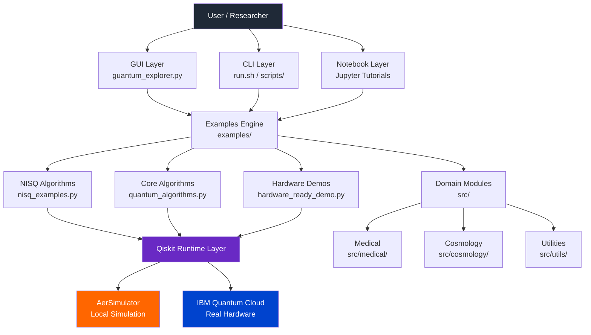
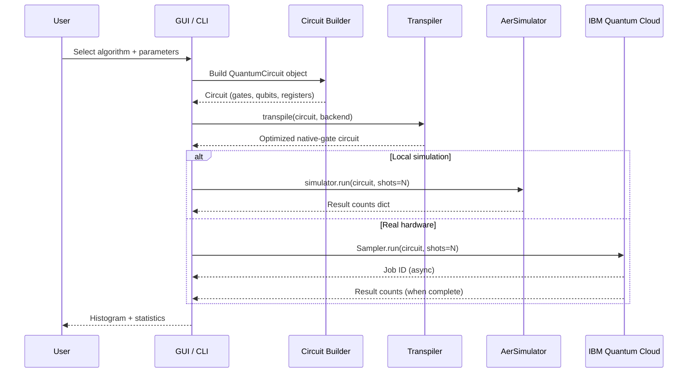
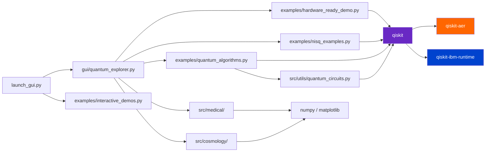
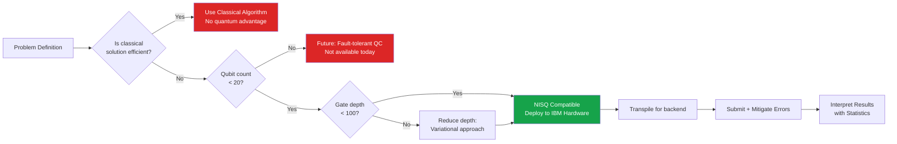
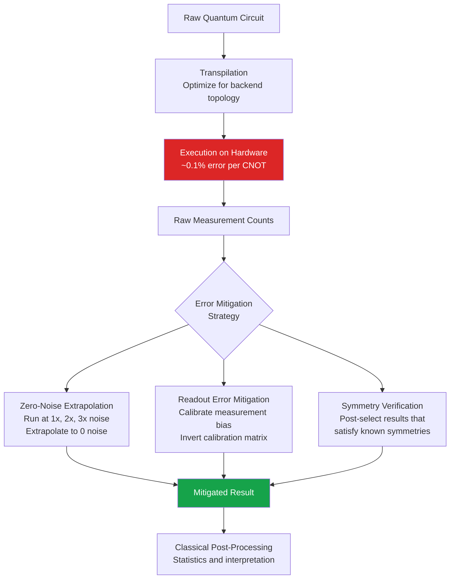

<p align="center">
  
  
  
  
  
  
</p>

<p align="center">
  
  
  
  
  
</p>

---

# Quantum Computing Explorer

> **A hardware-ready, NISQ-era quantum computing framework** that bridges the gap between classical simulation and real IBM quantum hardware. This project gives researchers, students, and engineers an interactive environment to learn, simulate, and deploy quantum algorithms - from foundational circuits to applications in cosmology, medical research, and optimization.

Quantum computing represents a fundamentally different computational paradigm. Instead of classical bits that hold either `0` or `1`, quantum computers use **qubits** that can exist in superpositions of both states simultaneously. When combined with entanglement and quantum interference, these properties allow certain algorithms to solve problems exponentially faster than any classical machine could. This repository provides a practical, hands-on toolkit for exploring that power today - using real quantum hardware accessible through IBM Quantum's cloud platform.

---

## Table of Contents

- [Why Quantum Computing?](#why-quantum-computing)
- [Quick Comparison - When to Use What](#quick-comparison---when-to-use-what)
- [Architecture Overview](#architecture-overview)
- [Tech Stack](#tech-stack)
- [Algorithms and Formulas](#algorithms-and-formulas)
- [Getting Started](#getting-started)
- [Project Structure](#project-structure)
- [Module Reference](#module-reference)
- [Running on IBM Hardware](#running-on-ibm-quantum-hardware)
- [Medical Applications](#medical-applications)
- [Cosmology Applications](#cosmology-applications)
- [Performance and Benchmarks](#performance-and-benchmarks)
- [Learning Resources](#learning-resources)
- [Citations and References](#citations-and-references)
- [Contributing](#contributing)

---

## Why Quantum Computing?

Classical computers represent information as bits - discrete `0` or `1` voltages stored in transistors. As transistors approach atomic scale, the classical roadmap is hitting physical limits. Quantum computing sidesteps this entirely by exploiting quantum mechanical effects: **superposition**, **entanglement**, and **interference**.

- **Superposition** means a qubit can be in a blend of `|0⟩` and `|1⟩` simultaneously - formally written as `α|0⟩ + β|1⟩` where α and β are complex probability amplitudes. This allows a quantum processor to evaluate many computational paths at once.
- **Entanglement** creates correlations between qubits that have no classical analog. Measuring one qubit instantly determines the state of its entangled partner, regardless of distance. This is the engine behind quantum cryptography and teleportation protocols.
- **Interference** is the mechanism through which correct answers are amplified and wrong answers cancel out. Grover's algorithm, for instance, uses destructive interference to eliminate non-solutions and constructive interference to highlight the correct answer in O(√N) steps.

We are currently in the **NISQ era** (Noisy Intermediate-Scale Quantum), characterized by devices with 50-500 qubits that are too noisy for full fault-tolerant computation but powerful enough to demonstrate genuine quantum utility for specific problems. This project is designed with NISQ constraints at its core.

> [!NOTE]
> NISQ stands for "Noisy Intermediate-Scale Quantum." Current quantum hardware has error rates of 0.1-1% per gate. This project's circuits are specifically kept shallow (low gate depth) to minimize accumulated noise before decoherence destroys the quantum state.

---

## Quick Comparison - When to Use What

Understanding when to reach for a quantum algorithm versus a classical one is the most important skill in applied quantum computing. The table below maps problem types to the best available approach, explains why, and flags the known limitations.

> [!IMPORTANT]
> Quantum computers are **not** universally faster. They provide advantage only for specific problem structures. Using a quantum algorithm on a problem without that structure will be slower than a classical laptop.

### Table 1 - Quantum vs Classical Algorithm Selection Guide

| # | Problem Type | Classical Best | Quantum Best | Quantum Speedup | When to Use Quantum | When NOT to Use Quantum |
|---|---|---|---|---|---|---|
| 1 | <sub>Unstructured search in N items</sub> | <sub>Linear scan O(N)</sub> | <sub>Grover O(√N)</sub> | <sub>Quadratic</sub> | <sub>Database search, collision finding</sub> | <sub>N < 1000, sorted data (use binary search)</sub> |
| 2 | <sub>Integer factoring</sub> | <sub>Best classical ~exp(N^1/3)</sub> | <sub>Shor O((log N)^3)</sub> | <sub>Exponential</sub> | <sub>Breaking RSA encryption (future)</sub> | <sub>Small numbers, NISQ hardware (too noisy)</sub> |
| 3 | <sub>Ground-state energy estimation</sub> | <sub>Full CI (exp cost)</sub> | <sub>VQE O(poly)</sub> | <sub>Exponential potential</sub> | <sub>Molecular simulation, drug discovery</sub> | <sub>Molecules > ~50 orbitals on current hardware</sub> |
| 4 | <sub>Combinatorial optimization</sub> | <sub>Simulated annealing, branch-and-bound</sub> | <sub>QAOA (heuristic)</sub> | <sub>Unknown (problem-dependent)</sub> | <sub>MaxCut, logistics, scheduling</sub> | <sub>When exact classical solvers fit in memory</sub> |
| 5 | <sub>Random number generation</sub> | <sub>PRNG (deterministic)</sub> | <sub>Hadamard + measure</sub> | <sub>Qualitative (true randomness)</sub> | <sub>Cryptography, Monte Carlo seeding</sub> | <sub>Statistical applications fine with PRNG</sub> |
| 6 | <sub>Linear systems Ax=b</sub> | <sub>Gaussian elimination O(N^3)</sub> | <sub>HHL O(log N poly(k))</sub> | <sub>Exponential (sparse A)</sub> | <sub>Large sparse systems in finance/ML</sub> | <sub>Dense matrices or when solution must be read out fully</sub> |
| 7 | <sub>Machine learning classification</sub> | <sub>SVM, neural nets</sub> | <sub>QSVM, QNN (heuristic)</sub> | <sub>Unclear</sub> | <sub>Research; quantum kernel advantage possible</sub> | <sub>Production ML today - classical dominates</sub> |
| 8 | <sub>Cryptographic hashing</sub> | <sub>SHA-256 classical</sub> | <sub>Grover halves security bits</sub> | <sub>Quadratic attack</sub> | <sub>Cryptanalysis research</sub> | <sub>Everyday data integrity checking</sub> |

### Table 2 - NISQ Algorithm Comparison Matrix

Each algorithm in this project was chosen based on noise tolerance, qubit count, and practical utility. This table explains every design decision.

| # | Algorithm | Qubits Needed | Gate Depth | Noise Tolerance | Why Chosen | Alternative Considered | Why Alternative Rejected |
|---|---|---|---|---|---|---|---|
| 1 | <sub>Deutsch-Josza</sub> | <sub>2 (demo)</sub> | <sub>~5</sub> | <sub>High</sub> | <sub>Clearest demonstration of quantum parallelism in one circuit query</sub> | <sub>Simon's algorithm</sub> | <sub>Simon's requires more ancilla qubits and is less intuitive for first learners</sub> |
| 2 | <sub>Grover's Search</sub> | <sub>3-5</sub> | <sub>~15</sub> | <sub>Medium</sub> | <sub>Quadratic speedup, demonstrable on hardware with 3 qubits</sub> | <sub>QRAM-based search</sub> | <sub>QRAM hardware doesn't exist yet; Grover works on existing machines</sub> |
| 3 | <sub>VQE (Variational)</sub> | <sub>2-6</sub> | <sub>Shallow (parametric)</sub> | <sub>High (hybrid)</sub> | <sub>Hybrid classical-quantum loop tolerates noise; best NISQ optimizer</sub> | <sub>QPE (Phase Estimation)</sub> | <sub>QPE needs deep circuits and error correction - not NISQ compatible</sub> |
| 4 | <sub>QAOA</sub> | <sub>4-10</sub> | <sub>2p (p=layers)</sub> | <sub>Medium-High</sub> | <sub>Variational structure same as VQE; handles combinatorial problems natively</sub> | <sub>Quantum annealing (D-Wave)</sub> | <sub>D-Wave hardware is specialized; QAOA runs on gate-model IBM machines</sub> |
| 5 | <sub>Bell State / Entanglement</sub> | <sub>2</sub> | <sub>2</sub> | <sub>Very High</sub> | <sub>Shallowest possible entanglement demo, near-perfect on real hardware</sub> | <sub>GHZ state (3 qubits)</sub> | <sub>GHZ decoherence is 3x faster; Bell state achieves demo goal more reliably</sub> |
| 6 | <sub>QFT (subset)</sub> | <sub>3-4</sub> | <sub>~N^2/2</sub> | <sub>Low-Medium</sub> | <sub>Foundation of Shor's and QPE; educational value essential</sub> | <sub>Full Shor's algorithm</sub> | <sub>Full Shor needs 2,000+ error-corrected qubits for meaningful factoring</sub> |

---

## Architecture Overview

The project is split into four distinct layers that communicate cleanly, ensuring the GUI, examples, and domain modules are independently runnable and testable.



The layered architecture ensures that changing the GUI never breaks the algorithm logic, and swapping simulation backends (local Aer vs. IBM cloud) requires only a one-line config change at the runtime layer. Domain modules (medical, cosmology) are isolated so new research domains can be plugged in without touching the core algorithm engine.

---

## System Data Flow

This diagram shows how a single quantum job flows from user intent through to measurement results, whether running on a local simulator or real quantum hardware.



> [!TIP]
> Transpilation is not optional. Qiskit's transpiler maps your logical circuit onto the physical qubit connectivity of the target backend, decomposes gates into native basis gates, and optimizes for lower depth. Always transpile before submitting to real hardware.

---

## Module Dependency Graph



---

## Tech Stack

The choices below were not arbitrary. Each dependency was selected against specific NISQ-era constraints and long-term maintainability goals.

### Table 3 - Full Tech Stack with Rationale

| # | Component | Package / Version | Purpose | Why This Choice | Alternative |
|---|---|---|---|---|---|
| 1 | <sub>Quantum SDK</sub> | <sub>Qiskit 1.x</sub> | <sub>Circuit construction, transpilation, execution</sub> | <sub>Largest open-source quantum SDK, direct IBM hardware access, active development</sub> | <sub>Cirq (Google) - less hardware access variety; PennyLane - ML-focused but less raw circuit control</sub> |
| 2 | <sub>Local Simulator</sub> | <sub>qiskit-aer</sub> | <sub>Statevector and shot-based simulation</sub> | <sub>Matches IBM hardware noise models exactly; can simulate up to ~30 qubits on laptop</sub> | <sub>QuTiP - more physics-focused but slower; numpy statevectors - no noise model</sub> |
| 3 | <sub>Cloud Runtime</sub> | <sub>qiskit-ibm-runtime</sub> | <sub>Submit jobs to 100+ qubit IBM machines</sub> | <sub>Only officially supported IBM Quantum client; provides Sampler/Estimator primitives</sub> | <sub>Direct REST API - too low level; no alternative for IBM hardware</sub> |
| 4 | <sub>GUI Framework</sub> | <sub>PyQt5</sub> | <sub>Interactive desktop application</sub> | <sub>Cross-platform, mature, integrates matplotlib canvases natively</sub> | <sub>Tkinter - limited styling; Streamlit - web-only, requires server</sub> |
| 5 | <sub>Visualization</sub> | <sub>matplotlib 3.x</sub> | <sub>Circuit diagrams, histograms, Bloch spheres</sub> | <sub>De facto scientific Python plotting; Qiskit visualization built on it</sub> | <sub>Plotly - better interactivity but heavier dependency</sub> |
| 6 | <sub>Numerics</sub> | <sub>numpy</sub> | <sub>State vector math, density matrices, statistics</sub> | <sub>Foundation of all scientific Python; Qiskit internally uses numpy arrays</sub> | <sub>No practical alternative for array math in Python</sub> |
| 7 | <sub>Notebooks</sub> | <sub>Jupyter</sub> | <sub>Interactive tutorials with inline circuit plots</sub> | <sub>Standard for scientific computing education; renders Qiskit visualizations inline</sub> | <sub>VS Code notebooks - good alternative but less portable sharing</sub> |
| 8 | <sub>LaTeX Rendering</sub> | <sub>pylatexenc</sub> | <sub>Render circuit gate labels in matplotlib</sub> | <sub>Required by Qiskit's circuit drawer for proper mathematical notation</sub> | <sub>None - required by Qiskit</sub> |

---

## Algorithms and Formulas

This section explains every quantum algorithm implemented in the project - the mathematical foundation, why it achieves speedup, and why this specific algorithm was chosen over alternatives. This is the intellectual core of the project.

### Deutsch-Josza Algorithm

The Deutsch-Josza algorithm solves a query problem that perfectly illustrates quantum parallelism. Given a black-box function f: {0,1}^n → {0,1} that is guaranteed to be either *constant* (same output for all inputs) or *balanced* (outputs 0 for exactly half of inputs and 1 for the other half), the algorithm determines which case holds in exactly **one** query. The best deterministic classical algorithm requires 2^(n-1) + 1 queries in the worst case.

The circuit starts by placing the input register in uniform superposition using Hadamard gates, then applies the oracle Uf, then applies Hadamard again and measures. If the result is all zeros, the function is constant; any other result means balanced. The key formula for the final state amplitude is:

$$|x\rangle \xrightarrow{H^{\otimes n}} \frac{1}{\sqrt{2^n}} \sum_{z \in \{0,1\}^n} (-1)^{f(x) \cdot z} |z\rangle$$

> [!NOTE]
> Deutsch-Josza is a "promise problem" - it only works because the function is *guaranteed* to be constant or balanced. This is why it's used as a teaching algorithm rather than a practical one: real-world functions are not given with this promise.

### Grover's Search Algorithm

Grover's algorithm searches an unsorted database of N items in O(√N) steps, compared to O(N) classically. This quadratic speedup is the maximum possible for unstructured search (proven by the BBBV theorem). The algorithm works by repeatedly applying a "Grover diffusion operator" that reflects the state around the mean amplitude, progressively amplifying the probability of measuring the target state.

After approximately $\frac{\pi}{4}\sqrt{N}$ iterations, the target state's probability reaches near 1. The diffusion operator is:

$$D = 2|\psi\rangle\langle\psi| - I \quad \text{where} \quad |\psi\rangle = H^{\otimes n}|0\rangle$$

**Why Grover's over classical search:** For a database of 1 million items, classical search needs up to 1,000,000 queries; Grover needs ~785. On quantum hardware, this is demonstrable with just 3 qubits (N=8). We use 3-5 qubits to keep circuits shallow enough for real hardware.

### Variational Quantum Eigensolver (VQE)

VQE is the workhorse of NISQ-era chemistry and materials science. It finds the ground-state energy of a molecule by variationally minimizing the expectation value of a Hamiltonian H using a parametric ansatz circuit U(θ):

$$E(\theta) = \langle\psi(\theta)|H|\psi(\theta)\rangle \geq E_{ground}$$

The classical computer optimizes the parameters θ (using COBYLA, SPSA, or gradient descent), while the quantum processor evaluates E(θ) for each new parameter set. This hybrid loop is key: the quantum part stays shallow (one forward pass), while the heavy lifting of optimization is done classically. VQE was chosen over Quantum Phase Estimation (QPE) specifically because QPE requires deep circuits incompatible with NISQ noise levels. VQE trades deterministic precision for noise tolerance.

**Medical application relevance:** Drug-receptor binding energies are ground-state problems. VQE can in principle compute binding affinities for small molecules that are intractable for classical density functional theory.

### QAOA (Quantum Approximate Optimization Algorithm)

QAOA addresses combinatorial optimization (MaxCut, TSP, portfolio optimization) by encoding the problem as an Ising Hamiltonian and applying alternating cost and mixer operators:

$$|\gamma, \beta\rangle = e^{-i\beta_p B} e^{-i\gamma_p C} \cdots e^{-i\beta_1 B} e^{-i\gamma_1 C} |+\rangle^{\otimes n}$$

where C is the cost Hamiltonian and B is the mixer (usually $\sum_i X_i$). As the number of layers p → ∞, QAOA converges to the exact solution. For practical NISQ use, p = 1 or p = 2 layers are used, giving approximate solutions that may still outperform classical heuristics on certain graph problems.

**Why QAOA over quantum annealing:** D-Wave quantum annealers are hardware-specific and can only do Ising problems. QAOA runs on standard gate-model quantum computers (IBM machines) and is more tunable.

### Quantum Fourier Transform (QFT)

The QFT is the quantum analog of the discrete Fourier transform, acting on computational basis states:

$$QFT|j\rangle = \frac{1}{\sqrt{N}} \sum_{k=0}^{N-1} e^{2\pi i jk/N} |k\rangle$$

It achieves this in O(n^2) gates vs. O(N log N) for the classical FFT (where N = 2^n). The QFT is implemented educationally here as it is the backbone of Shor's factoring algorithm and quantum phase estimation. We include it as a standalone module because understanding QFT is a prerequisite for every advanced quantum algorithm.

---

## NISQ Circuit Design Principles



> [!IMPORTANT]
> Every algorithm in this project follows a strict design checklist: (1) fewer than 20 qubits, (2) circuit depth under 100 for real hardware targets, (3) no mid-circuit measurement reliance unless the backend supports it, (4) classical post-processing handles result interpretation to keep quantum time minimal.

---

## Getting Started

### Prerequisites

Before cloning this repo, ensure your system has the following. Python 3.10+ is required because Qiskit 1.x dropped support for older versions and uses modern typing syntax throughout.

### Table 4 - Prerequisites Checklist

| # | Requirement | Minimum Version | Check Command | Why Required |
|---|---|---|---|---|
| 1 | <sub>Python</sub> | <sub>3.10+</sub> | <sub>`python3 --version`</sub> | <sub>Qiskit 1.x type annotations require 3.10+</sub> |
| 2 | <sub>pip</sub> | <sub>23+</sub> | <sub>`pip --version`</sub> | <sub>Dependency resolver needed for complex Qiskit deps</sub> |
| 3 | <sub>git</sub> | <sub>2.x</sub> | <sub>`git --version`</sub> | <sub>Cloning and version tracking</sub> |
| 4 | <sub>4 GB RAM</sub> | <sub>4 GB free</sub> | <sub>`free -h`</sub> | <sub>Aer statevector simulation of 25+ qubits is memory-intensive</sub> |
| 5 | <sub>Qt5 libs (Linux)</sub> | <sub>5.x</sub> | <sub>`apt list --installed \| grep qt5`</sub> | <sub>PyQt5 GUI requires system Qt5 libraries</sub> |
| 6 | <sub>IBM Account (optional)</sub> | <sub>n/a</sub> | <sub>quantum.ibm.com</sub> | <sub>Only needed for real hardware execution</sub> |

### Easy Setup (Recommended)

The `run.sh` script handles everything: virtual environment creation, dependency installation, and application launch. It checks your Python version first and exits with a clear error if requirements are not met.

```bash
# Clone the repository
git clone https://github.com/hkevin01/quantum-compute.git
cd quantum-compute

# Make the script executable (Linux/macOS)
chmod +x run.sh

# Launch the GUI (installs deps on first run)
./run.sh
```

### Manual Setup

Use manual setup if you need to integrate this into an existing virtual environment or CI pipeline.

```bash
# Create and activate virtual environment
python3 -m venv venv
source venv/bin/activate        # Linux/macOS
# venv\Scripts\activate         # Windows

# Install all dependencies
pip install -r requirements.txt

# Or install core only (no GUI)
pip install -r requirements-core.txt
```

### Table 5 - Run Modes and What They Do

| # | Command | What It Does | Use When |
|---|---|---|---|
| 1 | <sub>`./run.sh` or `./run.sh gui`</sub> | <sub>Launches the full PyQt5 GUI with all tabs: superposition, entanglement, NISQ algorithms, hardware connection</sub> | <sub>Interactive exploration, demos, running circuits visually</sub> |
| 2 | <sub>`./run.sh demos`</sub> | <sub>Runs interactive_demos.py in terminal; walks through circuits step by step with printed output</sub> | <sub>Quick terminal-based demo, no display required</sub> |
| 3 | <sub>`./run.sh test`</sub> | <sub>Runs the full pytest suite against all algorithm modules</sub> | <sub>CI validation, after code changes</sub> |
| 4 | <sub>`./run.sh examples`</sub> | <sub>Runs basic_quantum_examples.py showing Bell states, GHZ states, and measurement statistics</sub> | <sub>First-time learning, understanding circuit basics</sub> |
| 5 | <sub>`./run.sh nisq`</sub> | <sub>Runs nisq_examples.py: QRNG, VQE preview, QAOA MaxCut on 4-node graph</sub> | <sub>NISQ algorithm demonstration, hardware comparison</sub> |
| 6 | <sub>`./run.sh hardware`</sub> | <sub>Runs hardware_ready_demo.py: Bell state + Grover on 3 qubits, optimized for real quantum devices</sub> | <sub>Preparing circuits to send to IBM hardware</sub> |
| 7 | <sub>`./run.sh help`</sub> | <sub>Prints all available commands with descriptions</sub> | <sub>Discovering options</sub> |
| 8 | <sub>`python launch_gui.py`</sub> | <sub>Direct Python launch of GUI without run.sh wrapper</sub> | <sub>Custom Python environment, debugging GUI startup</sub> |

---

## Project Structure

The repository is organized so that each directory has a single clear responsibility. Domain science (medical, cosmology) is kept separate from quantum mechanics utilities so domain experts can contribute without needing to understand circuit optimization.

```
quantum-compute/
├── launch_gui.py              # Main entry point for the desktop GUI application
├── run.sh                     # Unified launcher script with all run modes
├── setup.py                   # Python package setup for src/ modules
├── requirements.txt           # Full dependency list (GUI + algorithms + viz)
├── requirements-core.txt      # Minimal deps (no GUI, for headless/CI use)
│
├── gui/
│   └── quantum_explorer.py    # PyQt5 multi-tab GUI; each tab = one algorithm family
│
├── examples/                  # Runnable standalone scripts (no imports from src/)
│   ├── basic_quantum_examples.py    # Bell states, GHZ, superposition
│   ├── quantum_algorithms.py        # Deutsch-Josza, Grover, QFT
│   ├── nisq_examples.py             # VQE, QAOA, QRNG - NISQ optimized
│   ├── hardware_ready_demo.py       # Circuits verified to run on real IBM hardware
│   └── interactive_demos.py         # Step-by-step guided terminal walkthrough
│
├── src/                       # Core importable modules
│   ├── utils/
│   │   └── quantum_circuits.py      # Reusable circuit primitives and helpers
│   ├── medical/               # Quantum-accelerated biomedical research modules
│   │   ├── drug_discovery.py        # VQE-based binding energy estimation
│   │   ├── protein_folding.py       # Quantum optimization for fold prediction
│   │   ├── genomic_analysis.py      # Quantum pattern matching on genomic data
│   │   └── biomarker_discovery.py   # Quantum ML for biomarker classification
│   └── cosmology/             # Astrophysics simulation modules
│       └── black_hole_simulation.py # Quantum circuit models of black hole thermodynamics
│
├── notebooks/
│   └── quantum_basics_tutorial.ipynb  # Jupyter tutorial: from qubits to Grover
│
├── docs/
│   ├── quantum_computing_guide.md     # Conceptual intro to quantum computing
│   ├── qiskit_guide.md                # Practical Qiskit usage patterns
│   └── space_medical_quantum_applications.md  # Research domain documentation
│
├── scripts/                   # One-off domain-specific run scripts
│   ├── run_black_hole_sim.py
│   ├── run_crispr_optimizer.py
│   ├── setup_environment.py
│   └── test_quantum.py
│
└── tests/                     # pytest test suite
    ├── __init__.py
    └── test_medical.py
```

> [!TIP]
> If you only want to run quantum algorithms without the GUI (e.g. on a headless server), install `requirements-core.txt` only. This avoids PyQt5 and matplotlib, reducing install time significantly and removing the need for a display server.

---

## Running on IBM Quantum Hardware

IBM Quantum provides free access to real quantum processors with up to 127 qubits through their cloud platform. This project is designed with this path in mind - every "hardware-ready" circuit uses only native basis gates and keeps depth under the coherence time budget of current devices.

> [!WARNING]
> Real quantum hardware has queue times ranging from seconds to hours depending on device demand. Plan accordingly. The `hardware_ready_demo.py` circuits are explicitly chosen to be short enough that queue wait time dominates over execution time.

### How to Get IBM Credentials

1. Create a free account at [quantum.ibm.com](https://quantum.ibm.com/)
2. Navigate to your account settings and generate an API token
3. Note your instance path (typically `ibm-q/open/main` for free tier)

### Setting Environment Variables

```bash
export QISKIT_IBM_TOKEN=your_api_token_here
export QISKIT_IBM_CHANNEL=ibm_quantum
export QISKIT_IBM_INSTANCE=ibm-q/open/main
```

For persistent storage, add these to your `~/.bashrc` or `~/.zshrc`.

### Table 6 - IBM Quantum Free Tier Hardware Comparison

| # | Device | Qubits | Basis Gates | Avg CNOT Error | T1 (us) | Best Use Case |
|---|---|---|---|---|---|---|
| 1 | <sub>ibm_brisbane</sub> | <sub>127</sub> | <sub>ECR, RZ, SX, X</sub> | <sub>~0.1%</sub> | <sub>~200</sub> | <sub>Larger QAOA, VQE with more qubits</sub> |
| 2 | <sub>ibm_sherbrooke</sub> | <sub>127</sub> | <sub>ECR, RZ, SX, X</sub> | <sub>~0.08%</sub> | <sub>~300</sub> | <sub>Best current free-tier device for algorithm research</sub> |
| 3 | <sub>ibm_kyoto</sub> | <sub>127</sub> | <sub>ECR, RZ, SX, X</sub> | <sub>~0.12%</sub> | <sub>~150</sub> | <sub>General purpose, frequently available</sub> |
| 4 | <sub>AerSimulator (local)</sub> | <sub>unlimited*</sub> | <sub>all</sub> | <sub>0% (ideal)</sub> | <sub>infinite</sub> | <sub>Development, debugging, large state exploration</sub> |

*Limited by RAM. 30 qubits requires ~16 GB; 40 qubits requires ~16 TB (statevector).

### Launch with Hardware Target

```bash
export QISKIT_IBM_TOKEN=your_token
./run.sh hardware
```

---

## Medical Applications

The `src/medical/` modules represent forward-looking research directions where quantum computing may provide genuine advantage over classical methods. These are simulation-based today but are architected to run on quantum hardware as device capabilities improve.

### Why Quantum for Drug Discovery?

Simulating how a drug molecule interacts with a protein target requires computing the quantum mechanical ground state of a combined electron system. For small molecules (~10-20 atoms), classical methods like Density Functional Theory (DFT) work reasonably well. But for larger molecules or when high accuracy is required, the full configuration interaction (FCI) method scales exponentially: an N-electron system requires 2^N basis states. Quantum computers represent this naturally - N qubits can represent 2^N states simultaneously.

VQE applied to molecular Hamiltonians has been demonstrated for H2, LiH, and BeH2 on real quantum hardware, giving ground-state energies within chemical accuracy (< 1 kcal/mol) of classical CCSD(T) benchmarks.

### Table 7 - Medical Module Capabilities

| # | Module | Algorithm | Problem Solved | Quantum Advantage | Status |
|---|---|---|---|---|---|
| 1 | <sub>drug_discovery.py</sub> | <sub>VQE + Jordan-Wigner transform</sub> | <sub>Molecular binding energy estimation</sub> | <sub>Exponential (for large molecules)</sub> | <sub>Framework ready, small molecule demo</sub> |
| 2 | <sub>protein_folding.py</sub> | <sub>QAOA on lattice model</sub> | <sub>Optimal protein fold configuration</sub> | <sub>Quadratic (heuristic)</sub> | <sub>Lattice model implemented</sub> |
| 3 | <sub>genomic_analysis.py</sub> | <sub>Quantum pattern matching</sub> | <sub>Sequence alignment in genomic data</sub> | <sub>Quadratic via Grover</sub> | <sub>Research prototype</sub> |
| 4 | <sub>biomarker_discovery.py</sub> | <sub>Quantum SVM / QNN</sub> | <sub>Disease biomarker classification</sub> | <sub>Potential kernel advantage</sub> | <sub>Conceptual framework</sub> |

> [!NOTE]
> The medical modules are research prototypes. They demonstrate how quantum algorithms map onto biomedical problems. Production-grade quantum drug discovery would require fault-tolerant hardware not yet available. The frameworks here are designed to be drop-in ready when that hardware arrives.

---

## Cosmology Applications

The `src/cosmology/` module models black hole thermodynamics using quantum circuits. This is rooted in the Hayden-Preskill protocol and quantum information theory's intersection with general relativity - specifically the question of whether information is destroyed in a black hole (the information paradox).

Quantum circuits can model the unitary evolution of information through a black hole's evaporation process. By treating the black hole as a quantum channel with specific entanglement properties, the module simulates whether information encoded in infalling matter can be recovered from Hawking radiation. This directly relates to the firewall paradox and ER=EPR conjectures.

> [!NOTE]
> The cosmology simulation is a quantum information theoretic model, not a gravitational simulation. It models the *information flow* properties of black hole evaporation, not spacetime curvature. This is a legitimate and active research area in quantum gravity.

---

## Error Mitigation

Real quantum hardware produces noisy results. This project uses several error mitigation strategies compatible with NISQ devices:



> [!TIP]
> For educational circuits (Bell states, Deutsch-Josza), readout error mitigation alone recovers near-ideal results on modern IBM hardware. Zero-noise extrapolation is most valuable for VQE and QAOA where accumulated gate errors significantly bias energy estimates.

---

## Performance and Benchmarks

### Table 8 - Simulation Performance by Qubit Count (Local Aer Simulator)

| # | Qubits | State Vector Size | RAM Required | Sim Time (statevector) | Sim Time (shot-based 1024) | Practical Limit |
|---|---|---|---|---|---|---|
| 1 | <sub>5</sub> | <sub>32 complex numbers</sub> | <sub>< 1 MB</sub> | <sub>< 1 ms</sub> | <sub>< 10 ms</sub> | <sub>All algorithms runnable</sub> |
| 2 | <sub>10</sub> | <sub>1,024 complex numbers</sub> | <sub>< 1 MB</sub> | <sub>< 1 ms</sub> | <sub>< 20 ms</sub> | <sub>All algorithms runnable</sub> |
| 3 | <sub>20</sub> | <sub>~1M complex numbers</sub> | <sub>~16 MB</sub> | <sub>~50 ms</sub> | <sub>~200 ms</sub> | <sub>All algorithms runnable</sub> |
| 4 | <sub>25</sub> | <sub>~33M complex numbers</sub> | <sub>~512 MB</sub> | <sub>~2 sec</sub> | <sub>~5 sec</sub> | <sub>VQE, QAOA still practical</sub> |
| 5 | <sub>30</sub> | <sub>~1B complex numbers</sub> | <sub>~16 GB</sub> | <sub>~60 sec</sub> | <sub>~3 min</sub> | <sub>High-end workstation only</sub> |
| 6 | <sub>40</sub> | <sub>~1T complex numbers</sub> | <sub>~16 TB</sub> | <sub>Impractical</sub> | <sub>Impractical</sub> | <sub>Requires HPC or real hardware</sub> |

This exponential scaling is precisely why quantum computers are needed - they represent 2^n states in n qubits with O(1) physical memory per qubit.

---

<details>
<summary><strong>API Reference - Click to expand full module documentation</strong></summary>

### `examples/quantum_algorithms.py` - SimpleQuantumAlgorithms

**Class: `SimpleQuantumAlgorithms`**

The main class providing educational implementations of canonical quantum algorithms. Instantiate once and call individual methods to run each algorithm.

```python
from examples.quantum_algorithms import SimpleQuantumAlgorithms

alg = SimpleQuantumAlgorithms()
```

---

**Method: `deuteeron_josza_algorithm(oracle_type: str = "constant") -> Dict`**

Runs the Deutsch-Josza algorithm and returns measurement results.

- `oracle_type`: `"constant"` or `"balanced"` - which type of oracle to simulate
- **Returns:** `dict` with keys `"counts"` (measurement histogram) and `"conclusion"` (string)
- **Circuit depth:** ~5 gates
- **Qubits:** 2

```python
result = alg.deuteeron_josza_algorithm(oracle_type="balanced")
# result["conclusion"] -> "Function is BALANCED"
```

---

### `examples/nisq_examples.py` - NISQQuantumExamples

**Class: `NISQQuantumExamples`**

Collection of NISQ-optimized circuits designed for real hardware execution.

**Method: `quantum_random_number_generator(num_bits=4, shots=1024) -> Tuple[List[int], QuantumCircuit]`**

Generates true quantum random numbers using Hadamard gates on all qubits followed by measurement.

- `num_bits`: number of random bits per sample (1-10 recommended)
- `shots`: number of times to run the circuit
- **Returns:** tuple of `(random_number_list, circuit_object)`
- **Circuit depth:** 1 (single layer of Hadamard gates - shallowest possible)

```python
from examples.nisq_examples import NISQQuantumExamples

nisq = NISQQuantumExamples()
numbers, circuit = nisq.quantum_random_number_generator(num_bits=8, shots=2048)
```

---

### `gui/quantum_explorer.py` - QuantumExplorer (GUI)

The main PyQt5 window. Tabs correspond to algorithm families. Each tab instantiates the relevant example class and provides a "Run" button that executes the circuit and plots results inline.

**Launching programmatically:**

```python
import sys
from PyQt5.QtWidgets import QApplication
from gui.quantum_explorer import QuantumExplorer

app = QApplication(sys.argv)
window = QuantumExplorer()
window.show()
sys.exit(app.exec_())
```

---

### Environment Variables

| Variable | Required | Default | Description |
|---|---|---|---|
| `QISKIT_IBM_TOKEN` | No | None | IBM Quantum API token for real hardware access |
| `QISKIT_IBM_CHANNEL` | No | `ibm_quantum` | IBM service channel |
| `QISKIT_IBM_INSTANCE` | No | `ibm-q/open/main` | IBM Quantum hub/group/project path |

</details>

---

## Learning Resources

The included documentation is organized by depth - start with the Jupyter notebook for hands-on basics, then the guides for theory, then the arXiv papers for cutting-edge research.

### Included Documentation

- [docs/quantum_computing_guide.md](docs/quantum_computing_guide.md) - Conceptual introduction covering qubits, gates, measurement, and algorithm design patterns.
- [docs/qiskit_guide.md](docs/qiskit_guide.md) - Practical Qiskit patterns: circuit construction, transpilation, backend selection, result interpretation.
- [docs/space_medical_quantum_applications.md](docs/space_medical_quantum_applications.md) - Research overview of quantum applications in medicine and astrophysics.
- [notebooks/quantum_basics_tutorial.ipynb](notebooks/quantum_basics_tutorial.ipynb) - Interactive Jupyter tutorial from single qubits to Grover's algorithm with inline visualizations.

> [!TIP]
> Start with the Jupyter notebook. It interleaves explanatory text with runnable code cells and shows circuit diagrams inline. After completing it, the examples/ scripts will make much more sense.

---

## Citations and References

This project builds on foundational academic work. The following references are cited throughout and are recommended reading for understanding the algorithms implemented here.

### Foundational Algorithms

1. **Deutsch, D. & Jozsa, R.** (1992). "Rapid solution of problems by quantum computation." *Proceedings of the Royal Society of London A*, 439, 553-558.

2. **Grover, L.K.** (1996). "A fast quantum mechanical algorithm for database search." *STOC '96 Proceedings*, ACM Press, 212-219. [arXiv:quant-ph/9605043](https://arxiv.org/abs/quant-ph/9605043)

3. **Shor, P.W.** (1994). "Algorithms for quantum computation: Discrete logarithms and factoring." *FOCS '94 Proceedings*, IEEE, 124-134. [arXiv:quant-ph/9508027](https://arxiv.org/abs/quant-ph/9508027)

4. **Peruzzo, A. et al.** (2014). "A variational eigenvalue solver on a photonic quantum processor." *Nature Communications*, 5, 4213. [arXiv:1304.3061](https://arxiv.org/abs/1304.3061) - *Original VQE paper*

5. **Farhi, E., Goldstone, J. & Gutmann, S.** (2014). "A Quantum Approximate Optimization Algorithm." [arXiv:1411.4028](https://arxiv.org/abs/1411.4028) - *Original QAOA paper*

### NISQ Era and Near-Term Quantum Computing

6. **Preskill, J.** (2018). "Quantum Computing in the NISQ era and beyond." *Quantum*, 2, 79. [arXiv:1801.00862](https://arxiv.org/abs/1801.00862) - *Coined the term NISQ*

7. **Bharti, K. et al.** (2022). "Noisy intermediate-scale quantum algorithms." *Reviews of Modern Physics*, 94, 015004. [arXiv:2101.08448](https://arxiv.org/abs/2101.08448)

8. **McClean, J.R. et al.** (2018). "Barren plateaus in quantum neural network training landscapes." *Nature Communications*, 9, 4812. [arXiv:1803.11173](https://arxiv.org/abs/1803.11173) - *Critical VQE limitation*

### Quantum Chemistry and Drug Discovery

9. **Cao, Y. et al.** (2019). "Quantum chemistry in the age of quantum computing." *Chemical Reviews*, 119(19), 10856-10915. [arXiv:1812.09976](https://arxiv.org/abs/1812.09976)

10. **Kivlichan, I.D. et al.** (2018). "Quantum simulation of electronic structure with linear depth and connectivity." *Physical Review Letters*, 120, 110501. [arXiv:1711.04789](https://arxiv.org/abs/1711.04789)

### Quantum Information and Black Holes

11. **Hayden, P. & Preskill, J.** (2007). "Black holes as mirrors: quantum information in random subsystems." *JHEP*, 2007(09), 120. [arXiv:0708.4025](https://arxiv.org/abs/0708.4025)

12. **Almheiri, A. et al.** (2013). "Black holes: complementarity or firewalls?" *JHEP*, 2013(02), 062. [arXiv:1207.3123](https://arxiv.org/abs/1207.3123) - *Firewall paradox*

### Error Mitigation

13. **Temme, K., Bravyi, S. & Gambetta, J.M.** (2017). "Error mitigation for short-depth quantum circuits." *Physical Review Letters*, 119, 180509. [arXiv:1612.02058](https://arxiv.org/abs/1612.02058)

14. **Li, Y. & Benjamin, S.C.** (2017). "Efficient variational quantum simulator incorporating active error minimization." *Physical Review X*, 7, 021050. [arXiv:1611.09301](https://arxiv.org/abs/1611.09301)

---

## Contributing

Contributions are welcome. The architecture is designed so that new algorithm modules, new domain science modules, and new GUI tabs can be added independently without touching existing code.

> [!NOTE]
> Before submitting a pull request: (1) run `./run.sh test` and ensure all tests pass, (2) keep any new circuits NISQ-compatible (shallow depth, low qubit count), (3) add docstrings following the NASA-style commenting standard used throughout the codebase, (4) if adding a new algorithm, add a row to the algorithm comparison table in this README.

```bash
# Development workflow
git checkout -b feature/your-algorithm-name
# ... implement ...
./run.sh test
git add -p
git commit -m "feat: add [algorithm name] with NISQ-optimized circuit"
git push origin feature/your-algorithm-name
```

---

<p align="center">
  <sub>Built for the NISQ era. Designed for the fault-tolerant future.</sub><br/>
  <sub>Quantum computing is not a replacement for classical computing - it is a complement, solving specific problems exponentially faster.</sub><br/><br/>
  
  
  
  
</p>
